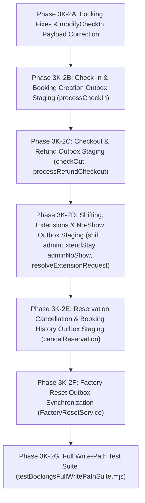

# PHASE 3K-2 BOOKINGS DOMAIN IMPLEMENTATION SPECIFICATION & SAFETY PLAN

**Date**: August 11, 2026  
**Author**: Antigravity AI Engine  
**Domain**: Bookings (`bookings` & `booking_history` MySQL tables / `bookings` & `booking_history` Firestore collections)  
**Status**: READ-ONLY IMPLEMENTATION SPECIFICATION & SAFETY PLAN  

---

## 1. Scope of Implementation

The scope of Phase 3K-2 covers bringing all **11 actual booking write paths** into 100% transactional outbox dual-write compliance, fixing identified database locking gaps, completing missing event payloads, staging booking history outbox events, and establishing end-to-end test verification.

### Target Components & Functions:

1. **`roomController.modifyCheckIn`** (`backend/controllers/roomController.js`):
   - Add missing `FOR UPDATE` locks on `rooms` and `bookings` queries.
   - Expand `BOOKING_UPDATED` outbox payload to include `guest_id`, `room_id`, `total_amount`, `booking_status`, and `payment_status`.
2. **`checkInService.processCheckIn`** (`backend/services/checkInService.js`):
   - Add outbox staging for `BOOKING_CREATED` (or `BOOKING_STATUS_CHANGED` when converting a reservation) inside the passed MySQL transaction before commit.
   - Add `FOR UPDATE` lock on guest profile phone lookup to prevent duplicate guest creation.
3. **`roomController.checkOut`** (`backend/controllers/roomController.js`):
   - Add `FOR UPDATE` lock on active booking lookup query (`SELECT b.* FROM bookings ... FOR UPDATE`).
   - Stage `BOOKING_STATUS_CHANGED` outbox event (`booking_status = 'Checked Out'`, `payment_status = 'Paid'`).
   - Stage `BOOKING_HISTORY_CREATED` outbox event for `CHECKED_OUT` history record.
4. **`roomController.shift`** (`backend/controllers/roomController.js`):
   - Implement deterministic lock ordering for source and target rooms (`WHERE number IN (?, ?) ORDER BY id ASC FOR UPDATE`) to eliminate deadlock risks.
   - Add `FOR UPDATE` lock on active booking query.
   - Stage `BOOKING_UPDATED` outbox event reflecting new `room_id` and `room_number`.
5. **`roomController.processRefundCheckout`** (`backend/controllers/roomController.js`):
   - Add `FOR UPDATE` lock on active booking query.
   - Stage `BOOKING_STATUS_CHANGED` outbox event (`booking_status = 'Checked Out'`, `payment_status = 'Refunded'`).
6. **`roomController.adminExtendStay`** (`backend/controllers/roomController.js`):
   - Add `FOR UPDATE` lock on booking row.
   - Stage `BOOKING_UPDATED` outbox event with updated `expected_check_out_date`.
7. **`roomController.adminNoShow`** (`backend/controllers/roomController.js`):
   - Add `FOR UPDATE` lock on reserved booking query.
   - Stage `BOOKING_STATUS_CHANGED` outbox event (`booking_status = 'No Show'`).
8. **`reservationController.cancelReservation`** (`backend/controllers/reservationController.js`):
   - Stage `BOOKING_STATUS_CHANGED` outbox event (`booking_status = 'Checked Out'`, `payment_status = 'Refunded'`).
   - Stage `BOOKING_HISTORY_CREATED` outbox event for `CANCELLED` history record.
9. **`auditController.resolveExtensionRequest`** (`backend/controllers/auditController.js`):
   - Stage `BOOKING_UPDATED` outbox event with updated `expected_check_out_date`.
10. **`FactoryResetService.factoryReset`** (`backend/services/FactoryResetService.js`):
    - Query existing booking numbers prior to deletion and stage `BOOKING_DELETED` outbox events within the factory reset transaction to guarantee Firestore cleanup.
11. **`roomController.bookRoom`** (`backend/controllers/roomController.js`):
    - *No architectural changes required* (already COMPLETE). Add `FOR UPDATE` lock on guest row lookup for loyalty points safety.

---

## 2. Locking Specification

To guarantee database isolation and eliminate lost updates, race conditions, and deadlocks, all SELECT queries preceding a write MUST utilize explicit row-level locking (`FOR UPDATE`) within an active MySQL transaction (`connection.beginTransaction()`).

### Detailed Locking Rules by Function:

#### A. `modifyCheckIn`
- **Current Query**:
  ```sql
  SELECT id, status FROM rooms WHERE number = ?
  SELECT * FROM bookings WHERE room_id = ? AND booking_status IN ('Checked In', 'Reserved') ORDER BY id DESC LIMIT 1
  ```
- **Corrected Query**:
  ```sql
  SELECT id, status FROM rooms WHERE number = ? FOR UPDATE
  SELECT * FROM bookings WHERE room_id = ? AND booking_status IN ('Checked In', 'Reserved') ORDER BY id DESC LIMIT 1 FOR UPDATE
  ```
- **Rationale**: Prevents concurrent reception edits or parallel checkout operations from reading stale booking state while modifications are in flight.
- **Lock Target**: `rooms` row, then `bookings` row.

#### B. `checkOut`
- **Current Query**:
  ```sql
  SELECT r.*, rt.base_rate as rate, rt.code as type FROM rooms r JOIN room_types rt ON r.room_type_id = rt.id WHERE r.number = ? FOR UPDATE
  SELECT b.*, g.full_name as guestName FROM bookings b JOIN guests g ON b.guest_id = g.id WHERE b.room_id = ? AND b.booking_status = 'Checked In'
  ```
- **Corrected Query**:
  ```sql
  SELECT r.*, rt.base_rate as rate, rt.code as type FROM rooms r JOIN room_types rt ON r.room_type_id = rt.id WHERE r.number = ? FOR UPDATE
  SELECT b.*, g.full_name as guestName FROM bookings b JOIN guests g ON b.guest_id = g.id WHERE b.room_id = ? AND b.booking_status = 'Checked In' FOR UPDATE
  ```
- **Rationale**: Prevents duplicate checkout requests on the same room from simultaneously reading the booking before status is updated to `'Checked Out'`.
- **Lock Target**: `rooms` row, then `bookings` and `guests` rows.

#### C. `shift`
- **Current Query**:
  ```sql
  SELECT r.* ... FROM rooms r ... WHERE r.number = ? FOR UPDATE -- source
  SELECT r.* ... FROM rooms r ... WHERE r.number = ? FOR UPDATE -- target
  SELECT * FROM bookings WHERE room_id = ? AND booking_status = 'Checked In'
  ```
- **Corrected Locking Strategy (Deadlock Prevention)**:
  - To prevent deadlocks when two rooms are being shifted simultaneously (Room A -> Room B and Room B -> Room A), rooms must be locked in deterministic primary key order (`id ASC`):
  ```js
  const roomNumbers = [fromRoomNumber, toRoomNumber];
  const [rooms] = await connection.query(
    `SELECT r.*, rt.base_rate as rate, rt.code as type
     FROM rooms r JOIN room_types rt ON r.room_type_id = rt.id
     WHERE r.number IN (?, ?) ORDER BY r.id ASC FOR UPDATE`,
    [fromRoomNumber, toRoomNumber]
  );
  ```
  - Lock active booking:
  ```sql
  SELECT * FROM bookings WHERE room_id = ? AND booking_status = 'Checked In' FOR UPDATE
  ```
- **Lock Target**: Both `rooms` rows (ordered by ID), then `bookings` row.

#### D. `processCheckIn` (checkInService.js)
- **Current Query**:
  - `rooms` locked with `FOR UPDATE` (Line 48).
  - `reservations` locked with `FOR UPDATE` (Line 92/101).
  - Guest lookup: `SELECT id FROM guests WHERE phone = ? LIMIT 1` (Line 134) — **MISSING FOR UPDATE**.
- **Corrected Query**:
  ```sql
  SELECT id FROM guests WHERE phone = ? LIMIT 1 FOR UPDATE
  ```
- **Rationale**: Prevents parallel walk-in check-ins with the same guest phone number from creating duplicate guest records.

---

## 3. Event Contract Specification

All booking domain events MUST strictly adhere to the 5 approved event types in `outboxDispatcher.js`.

| Operation | MySQL Table & Verb | Event Type | Aggregate Type | Aggregate ID | Required Payload Fields | `updated_at` Strategy | Firestore Repos Method | Idempotency & Stale Strategy |
|---|---|---|---|---|---|---|---|---|
| `processCheckIn` | `bookings` (INSERT) | `BOOKING_CREATED` | `BOOKING` | `booking_number` | `booking_number`, `guest_id`, `room_id`, `room_number`, `check_in_date`, `expected_check_out_date`, `adults`, `booking_status`, `payment_status`, `total_amount`, `advance_amount`, `mysql_booking_id` | `new Date().toISOString()` | `createBookingFirestore` | Deterministic `bkg_<booking_number>` doc ID. Ignored if duplicate. |
| `bookRoom` | `bookings` (INSERT) | `BOOKING_CREATED` | `BOOKING` | `booking_number` | `booking_number`, `guest_id`, `room_id`, `room_number`, `check_in_date`, `expected_check_out_date`, `adults`, `booking_status`, `payment_status`, `total_amount`, `advance_amount`, `mysql_booking_id` | `new Date().toISOString()` | `createBookingFirestore` | Deterministic `bkg_<booking_number>` doc ID. Ignored if duplicate. |
| `modifyCheckIn` | `bookings` (UPDATE) | `BOOKING_UPDATED` | `BOOKING` | `booking_number` | `booking_number`, `guest_id`, `room_id`, `check_in_date`, `expected_check_out_date`, `adults`, `advance_amount`, `total_amount`, `booking_status`, `payment_status`, `billing_instruction`, `meal_plan`, `mysql_booking_id` | `new Date().toISOString()` | `updateBookingFirestore` | Timestamp `isStaleUpdate` protection. Merges cleanly into existing doc. |
| `checkOut` | `bookings` (UPDATE) | `BOOKING_STATUS_CHANGED` | `BOOKING` | `booking_number` | `booking_number`, `booking_status` (`Checked Out`), `payment_status` (`Paid`), `total_amount`, `check_out_date`, `mysql_booking_id` | `new Date().toISOString()` | `updateBookingStatusFirestore` | Updates status & payment status with `updated_at` stale protection. |
| `checkOut` | `booking_history` (INSERT) | `BOOKING_HISTORY_CREATED` | `BOOKING_HISTORY` | `history_<mysql_id>` | `history_id`, `booking_id` (`bkg_<num>`), `mysql_booking_id`, `action` (`CHECKED_OUT`), `details`, `changed_by`, `business_date`, `mysql_history_id` | `new Date().toISOString()` | `createBookingHistoryFirestore` | Deterministic doc ID `history_<mysql_id>`. Writes root & subcollection. |
| `shift` | `bookings` (UPDATE) | `BOOKING_UPDATED` | `BOOKING` | `booking_number` | `booking_number`, `room_id` (new), `room_number` (new), `mysql_booking_id` | `new Date().toISOString()` | `updateBookingFirestore` | Updates room association with `updated_at` stale protection. |
| `processRefundCheckout` | `bookings` (UPDATE) | `BOOKING_STATUS_CHANGED` | `BOOKING` | `booking_number` | `booking_number`, `booking_status` (`Checked Out`), `payment_status` (`Refunded`), `check_out_date`, `mysql_booking_id` | `new Date().toISOString()` | `updateBookingStatusFirestore` | Updates status & payment status with `updated_at` stale protection. |
| `adminExtendStay` | `bookings` (UPDATE) | `BOOKING_UPDATED` | `BOOKING` | `booking_number` | `booking_number`, `expected_check_out_date`, `mysql_booking_id` | `new Date().toISOString()` | `updateBookingFirestore` | Updates checkout date with `updated_at` stale protection. |
| `adminNoShow` | `bookings` (UPDATE) | `BOOKING_STATUS_CHANGED` | `BOOKING` | `booking_number` | `booking_number`, `booking_status` (`No Show`), `check_out_date`, `mysql_booking_id` | `new Date().toISOString()` | `updateBookingStatusFirestore` | Updates status to `No Show` with `updated_at` stale protection. |
| `cancelReservation` | `bookings` (UPDATE) | `BOOKING_STATUS_CHANGED` | `BOOKING` | `booking_number` | `booking_number`, `booking_status` (`Checked Out`), `payment_status` (`Refunded`), `mysql_booking_id` | `new Date().toISOString()` | `updateBookingStatusFirestore` | Updates status & payment status with `updated_at` stale protection. |
| `cancelReservation` | `booking_history` (INSERT) | `BOOKING_HISTORY_CREATED` | `BOOKING_HISTORY` | `history_<mysql_id>` | `history_id`, `booking_id` (`bkg_<num>`), `mysql_booking_id`, `action` (`CANCELLED`), `details`, `changed_by`, `business_date`, `mysql_history_id` | `new Date().toISOString()` | `createBookingHistoryFirestore` | Deterministic doc ID `history_<mysql_id>`. Writes root & subcollection. |
| `resolveExtensionRequest` | `bookings` (UPDATE) | `BOOKING_UPDATED` | `BOOKING` | `booking_number` | `booking_number`, `expected_check_out_date`, `mysql_booking_id` | `new Date().toISOString()` | `updateBookingFirestore` | Updates checkout date with `updated_at` stale protection. |
| `factoryReset` | `bookings` (DELETE) | `BOOKING_DELETED` | `BOOKING` | `booking_number` | `booking_number`, `docId` (`bkg_<num>`) | N/A | `deleteBookingFirestore` | Idempotent doc deletion (`NOT_FOUND` swallowed). |

---

## 4. `modifyCheckIn` Corrected Payload Specification

The current implementation of `roomController.modifyCheckIn` passes an incomplete payload to `enqueue()` (missing `guest_id`, `room_id`, `total_amount`, and `booking_status`).

### Corrected Outbox Staging Code:
```javascript
if (isFirestoreDualWriteEnabled()) {
  await enqueue(connection, {
    event_type: 'BOOKING_UPDATED',
    aggregate_type: 'BOOKING',
    aggregate_id: booking.booking_number,
    payload: {
      booking_number: String(booking.booking_number),
      guest_id: String(booking.guest_id),
      room_id: String(booking.room_id),
      check_in_date: String(checkInDate || booking.check_in_date),
      expected_check_out_date: String(expectedCheckOutDate || booking.expected_check_out_date || ''),
      adults: parsedPax,
      advance_amount: parsedDeposit,
      total_amount: Number(booking.total_amount || 0),
      booking_status: String(booking.booking_status),
      payment_status: String(booking.payment_status || 'Pending'),
      billing_instruction: resolvedBilling,
      meal_plan: resolvedMealPlan,
      mysql_booking_id: booking.id,
      updated_at: new Date().toISOString()
    }
  });
}
```

---

## 5. Booking History Design

### Event Contract for `BOOKING_HISTORY_CREATED`:

1. **Source Locations**:
   - `roomController.checkOut` (line 184)
   - `reservationController.cancelReservation` (line 483)
2. **Outbox Event Staging**:
   ```javascript
   const [histRes] = await connection.query(
     `INSERT INTO booking_history (booking_id, action, old_room_id, new_room_id, changed_by, business_date, notes)
      VALUES (?, ?, ?, ?, ?, ?, ?)`,
     [booking.id, actionStr, oldRoomId, newRoomId, userId, businessDate, notesStr]
   );
   const historyId = `history_${histRes.insertId}`;

   if (isFirestoreDualWriteEnabled()) {
     await enqueue(connection, {
       event_type: 'BOOKING_HISTORY_CREATED',
       aggregate_type: 'BOOKING_HISTORY',
       aggregate_id: historyId,
       payload: {
         history_id: historyId,
         booking_id: booking.booking_number,
         mysql_booking_id: booking.id,
         action: actionStr,
         details: notesStr,
         changed_by: userId ? String(userId) : null,
         business_date: businessDate,
         mysql_history_id: histRes.insertId,
         created_at: new Date().toISOString(),
         updated_at: new Date().toISOString()
       }
     });
   }
   ```
3. **Firestore Destination**:
   - Primary root collection: `booking_history/{historyId}`
   - Subcollection: `bookings/bkg_<booking_number>/history/{historyId}`
4. **Idempotency & Replay Safety**: `createBookingHistoryFirestore` uses `setDoc(..., merge: true)` on deterministic ID `history_<mysql_history_id>`. Repeated dispatch cleanly overwrites with identical payload.

---

## 6. Factory Reset Strategy

### Architectural Decision: Controlled Destructive Reset Sync

`FactoryResetService.factoryReset` deletes all rows from `bookings` and `booking_history` in a single MySQL transaction. 

### Selected Strategy: **Transactional Outbox Event Enqueuing (Option A)**

1. **Pre-Delete Booking Query**:
   Prior to executing `DELETE FROM bookings`, query all existing booking numbers inside the factory reset transaction:
   ```javascript
   const [existingBookings] = await conn.query('SELECT id, booking_number FROM bookings');
   ```
2. **Stage `BOOKING_DELETED` Events**:
   For each booking found, stage a `BOOKING_DELETED` outbox event inside the same transaction:
   ```javascript
   for (const bkg of existingBookings) {
     await enqueue(conn, {
       event_type: 'BOOKING_DELETED',
       aggregate_type: 'BOOKING',
       aggregate_id: bkg.booking_number,
       payload: {
         booking_number: String(bkg.booking_number),
         docId: `bkg_${bkg.booking_number}`,
         updated_at: new Date().toISOString()
       }
     });
   }
   ```
3. **Outbox Purge**:
   Delete prior pending outbox logs for `BOOKING` aggregate types to prevent obsolete updates from executing post-reset.
4. **Worker Processing**:
   When the outbox worker processes the batch, `BOOKING_DELETED` cleanly invokes `deleteBookingFirestore(docId)` for each document, ensuring Firestore is reset in exact step with MySQL.

---

## 7. Security Rules & Sanitization

1. **Credential Exclusions**: Outbox payloads for booking operations strictly exclude any guest authentication credentials, password hashes, or session tokens.
2. **Financial Secrets Exclusions**: Payment payloads contain total amounts and payment types (`Cash`, `Razorpay`), but NEVER credit card numbers, CVVs, or gateway secret keys.
3. **Firestore Security Rules Alignment**:
   - `bookings/{bookingId}`: Read allowed for authenticated users matching `request.auth.uid == resource.data.guest_user_uid` or staff/admin roles. Write allowed only via Admin SDK (backend outbox dispatcher).
   - `booking_history/{historyId}`: Read allowed for staff/admin roles. Write allowed only via Admin SDK.

---

## 8. Test Plan (`backend/tests/testBookingsFullWritePathSuite.mjs`)

### Test Case Definitions:

| Test Case # | Description | Pre-Conditions | Steps | Post-Conditions & Expected Results |
|---|---|---|---|---|
| TC-BKG-01 | Walk-in Check-In Execution (`processCheckIn`) | Vacant Room 101 in DB | Call `processCheckIn` inside transaction | Booking created in MySQL (`Checked In`), `BOOKING_CREATED` staged in `dual_write_outbox`. Worker syncs doc `bkg_<num>` to Firestore. |
| TC-BKG-02 | Online Room Booking (`bookRoom`) | Vacant Room 102 in DB | Call `bookRoom` API endpoint | Booking created (`Reserved`), `BOOKING_CREATED` staged. Worker syncs `bkg_<num>` to Firestore with `booking_status = 'Reserved'`. |
| TC-BKG-03 | Modify Check-In Details (`modifyCheckIn`) | Active booking on Room 101 | Call `modifyCheckIn` API endpoint | MySQL updated. `BOOKING_UPDATED` staged with complete payload. Worker updates Firestore `adults`, dates, and deposit. |
| TC-BKG-04 | Guest Checkout Settlement (`checkOut`) | Active checked-in booking on Room 101 | Call `checkOut` API endpoint | Booking updated (`Checked Out`, `Paid`). History row inserted. `BOOKING_STATUS_CHANGED` and `BOOKING_HISTORY_CREATED` staged and dispatched to Firestore. |
| TC-BKG-05 | Active Room Shift (`shift`) | Checked-in booking on Room 101, Vacant Room 103 | Call `shift` API endpoint | Booking `room_id` updated to 103. `BOOKING_UPDATED` staged. Worker reflects new `room_number` in Firestore. |
| TC-BKG-06 | Refund Checkout (`processRefundCheckout`) | Checked-in booking on Room 103 | Call `processRefundCheckout` API endpoint | Booking updated (`Checked Out`, `Refunded`). `BOOKING_STATUS_CHANGED` staged and dispatched to Firestore. |
| TC-BKG-07 | Admin Extend Stay (`adminExtendStay`) | Checked-in booking on Room 103 | Call `adminExtendStay` API endpoint | Booking `expected_check_out_date` extended. `BOOKING_UPDATED` staged and dispatched to Firestore. |
| TC-BKG-08 | Admin Mark No Show (`adminNoShow`) | Reserved booking on Room 104 | Call `adminNoShow` API endpoint | Booking status updated to `No Show`. `BOOKING_STATUS_CHANGED` staged and dispatched to Firestore. |
| TC-BKG-09 | Cancel Reservation with Booking (`cancelReservation`) | Reservation linked to active booking | Call `cancelReservation` API endpoint | Booking updated (`Checked Out`, `Refunded`). History row created. `BOOKING_STATUS_CHANGED` & `BOOKING_HISTORY_CREATED` staged and dispatched. |
| TC-BKG-10 | Resolve Extension Request (`resolveExtensionRequest`) | Pending extension request | Call `resolveExtensionRequest` API (action='approve') | Booking `expected_check_out_date` updated. `BOOKING_UPDATED` staged and dispatched. |
| TC-BKG-11 | Transaction Rollback Atomicity | Valid room & guest | Start transaction, insert booking, stage outbox event, force error, call `rollback()` | MySQL booking rolled back; outbox table contains 0 rows for test aggregate ID. |
| TC-BKG-12 | Stale Event Guard Verification | Firestore document at time T2 | Dispatch `BOOKING_UPDATED` event with older timestamp T0 (T0 < T2) | Worker processes event; `isStaleUpdate` guard rejects payload and preserves T2 state in Firestore. |
| TC-BKG-13 | Duplicate Outbox Replay | Outbox event processed once | Execute `processOutboxBatch` again with same event | Worker handles idempotently (`setDoc(..., merge: true)`); zero duplicate Firestore docs created. |
| TC-BKG-14 | Controlled Factory Reset (`factoryReset`) | Active bookings in DB | Execute `FactoryResetService.factoryReset()` | All bookings deleted from MySQL. `BOOKING_DELETED` events staged and processed by worker; Firestore booking documents removed cleanly. |
| TC-BKG-15 | Concurrency Race Condition (`FOR UPDATE` test) | Single active booking | Launch 5 parallel requests to `modifyCheckIn` and `checkOut` | MySQL row locks serialize requests cleanly without deadlocks or lost updates. |

---

## 9. Risk Matrix

| Risk ID | Risk Description | Severity | Impact | Mitigation Strategy | Block Implementation? | Block Production Cutover? |
|---|---|---|---|---|---|---|
| R-01 | Missing `FOR UPDATE` in `modifyCheckIn`, `checkOut`, `shift` | **P1** | High — Concurrent requests cause race conditions, dirty reads, and state corruptions | Add explicit `FOR UPDATE` queries inside MySQL transactions prior to reads | YES | YES |
| R-02 | Incomplete payload in `modifyCheckIn` `BOOKING_UPDATED` event | **P1** | High — Firestore document left out of sync missing `guest_id`, `room_id`, `booking_status` | Expand `modifyCheckIn` outbox payload to include full booking state | YES | YES |
| R-03 | Missing outbox staging across 9 booking write paths | **P1** | High — Firestore unsynchronized for check-ins, check-outs, shifts, extensions, and cancellations | Add `enqueue()` calls inside MySQL transactions across all 9 paths | YES | YES |
| R-04 | Missing booking history outbox staging | **P2** | Medium — `booking_history` subcollections in Firestore incomplete | Stage `BOOKING_HISTORY_CREATED` outbox events in `checkOut` and `cancelReservation` | NO | YES |
| R-05 | Deadlock risk in simultaneous room shift requests | **P1** | High — Parallel room shifts (A->B and B->A) cause MySQL transaction deadlocks | Order room locks deterministically by room `id ASC` (`WHERE number IN (?, ?) ORDER BY id ASC FOR UPDATE`) | YES | YES |
| R-06 | Factory reset un-synced with Firestore | **P2** | Medium — MySQL reset leaves orphaned booking documents in Firestore | Query existing booking numbers and stage `BOOKING_DELETED` events inside factory reset transaction | NO | YES |

---

## 10. Staged Implementation Sequence



### Sequence Breakdown:

1. **Phase 3K-2A**: Fix locking defects in `modifyCheckIn`, `checkOut`, and `shift`. Correct `modifyCheckIn` event payload.
2. **Phase 3K-2B**: Integrate `BOOKING_CREATED` outbox staging into `checkInService.processCheckIn`.
3. **Phase 3K-2C**: Integrate `BOOKING_STATUS_CHANGED` and `BOOKING_HISTORY_CREATED` into `checkOut` and `processRefundCheckout`.
4. **Phase 3K-2D**: Integrate `BOOKING_UPDATED` and `BOOKING_STATUS_CHANGED` into `shift`, `adminExtendStay`, `adminNoShow`, and `resolveExtensionRequest`.
5. **Phase 3K-2E**: Integrate `BOOKING_STATUS_CHANGED` and `BOOKING_HISTORY_CREATED` into `reservationController.cancelReservation`.
6. **Phase 3K-2F**: Add pre-delete booking query and `BOOKING_DELETED` outbox staging to `FactoryResetService.factoryReset`.
7. **Phase 3K-2G**: Construct and execute `testBookingsFullWritePathSuite.mjs` (15/15 tests passing).

---

## 11. Verification Gates

Prior to declaring Phase 3K-2 ready for feature flag activation, the following verification gates MUST pass:

1. **Gate 1**: Codebase audit confirms all 11 write paths execute `enqueue()` within an active MySQL transaction before `commit()`.
2. **Gate 2**: Codebase audit confirms all 11 write paths handle error rollbacks cleanly without outbox event leakage.
3. **Gate 3**: Codebase audit confirms all locking queries use `FOR UPDATE` with deadlock-safe ordering.
4. **Gate 4**: `testBookingsDualWriteFoundation.mjs` passes 16/16 tests cleanly.
5. **Gate 5**: `testBookingsCreateUpdateDualWritePilot.mjs` passes 19/19 tests cleanly.
6. **Gate 6**: New comprehensive test suite `testBookingsFullWritePathSuite.mjs` passes 15/15 tests cleanly.

---

## 12. Rollback Strategy

If any issue is detected during Phase 3K-2 testing or staging:
1. **Feature Flag Isolation**: Keep `ENABLE_FIRESTORE_DUAL_WRITE=false` and `ENABLE_FIRESTORE_OUTBOX_WORKER=false`. When these flags are `false`, outbox enqueuing and worker processing are completely bypassed without impacting MySQL operations.
2. **Outbox Purge**: Execute `DELETE FROM dual_write_outbox WHERE aggregate_type IN ('BOOKING', 'BOOKING_HISTORY')` if un-dispatched test events remain in MySQL.
3. **Zero Production Risk**: Because all outbox writes occur inside existing MySQL transactions, any database failure triggers an automatic rollback, leaving MySQL data completely unaffected.

---

FINAL VERDICT:

**PHASE 3K-2 IMPLEMENTATION SPEC STATUS:**  
**READY FOR IMPLEMENTATION**
