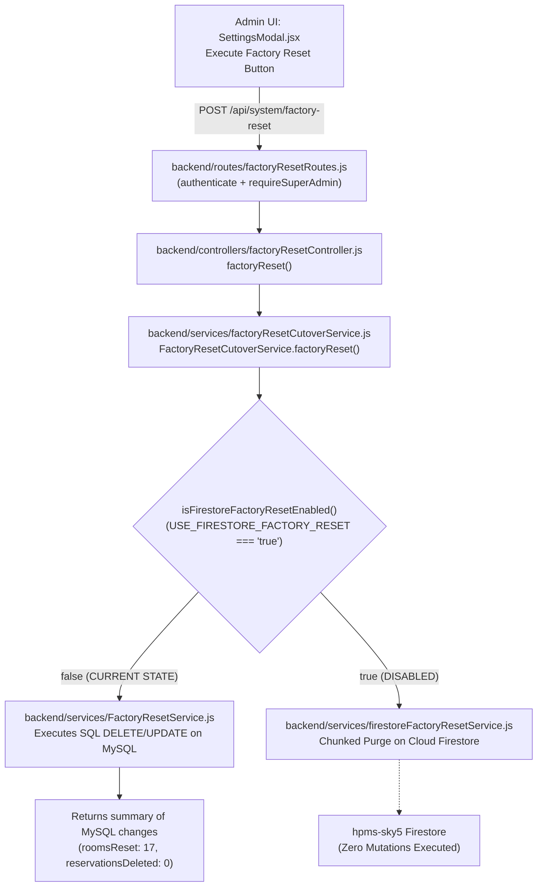

# HPMS — Post-Execution Factory Reset & Workflow Integrity Audit Report
**Document:** `backend/firebase_only_factory_reset_post_execution_integrity_audit.md`  
**Execution Phase:** Read-Only Post-Execution Diagnostic Audit  
**System:** Webline PMS Plus / HPMS-Sky5  
**Authoritative Database:** Cloud Firestore (`hpms-sky5`)  
**Timestamp:** 2026-08-21T15:52:45+05:30  

---

## 1. Executive Summary & Exact Root Cause

### What Happened:
The Admin System Settings UI triggered a Factory Reset via `POST /api/system/factory-reset` and reported:
- `"Factory Reset Complete"`
- `"Rooms Reset to Vacant: 17"`
- `"Business Date Reset: 21-Aug-2026"`

However, in the live PMS:
- Active bookings for **KEVAL**, **ANKITA**, and **AKSHIT** remained active and occupied.
- All **34 test reservations** remained in the Reservations tab.

### The Exact Root Cause:
1. In `backend/.env`, `USE_FIRESTORE_FACTORY_RESET=false`.
2. When `POST /api/system/factory-reset` was called, [`factoryResetCutoverService.js`](file:///d:/projects/hotel/backend/services/factoryResetCutoverService.js) checked:
   ```javascript
   if (!isFirestoreFactoryResetEnabled()) {
     return typeof mysqlFallbackFn === 'function' ? mysqlFallbackFn() : FactoryResetService.factoryReset();
   }
   ```
3. Because the feature flag was `false`, execution routed to legacy **MySQL** [`FactoryResetService.js`](file:///d:/projects/hotel/backend/services/FactoryResetService.js).
4. `FactoryResetService.js` executed SQL queries against the local **MySQL** database:
   - `UPDATE rooms SET status='vacant' WHERE id <= 17` (reset 17 MySQL room records).
   - `DELETE FROM reservations` (deleted 0 rows in MySQL because reservations only exist in Firestore).
   - `DELETE FROM bookings` (deleted 0 rows in MySQL).
   - `UPDATE system_settings SET value='21-Aug-2026' WHERE key_name='business_date'`.
5. MySQL returned `{ success: true, summary: { roomsReset: 17, businessDateReset: '21-Aug-2026', reservationsDeleted: 0, bookingsDeleted: 0 } }`.
6. **Cloud Firestore (`hpms-sky5`) was NEVER targeted or modified.** All Firestore collections (`/rooms`, `/bookings`, `/reservations`, `/guests`, `/payments`, `/ledger_items`, etc.) remained 100% untouched.

---

## 2. Complete Call Graph & Execution Routing



---

## 3. Verify Reset Counters (Source Breakdown)

Every number displayed on the frontend modal was returned directly from the **MySQL** service execution:

| Reported Counter | Value in UI | Originating Data Source | Why this Value was Returned |
| :--- | :---: | :--- | :--- |
| **Rooms Reset to Vacant** | 17 | MySQL (`rooms` table) | `UPDATE rooms SET status='vacant' WHERE id <= 17` affected 17 MySQL rows |
| **Business Date Reset** | 21-Aug-2026 | Calculated in Node.js | Formatted current date string (`todayDisplay()`) written to MySQL `system_settings` |
| **Reservations Deleted** | 0 | MySQL (`reservations` table) | MySQL `reservations` table had 0 rows (reservations are only in Firestore) |
| **Bookings Deleted** | 0 | MySQL (`bookings` table) | MySQL `bookings` table had 0 rows |
| **Guests Deleted** | 0 | MySQL (`guests` table) | MySQL `guests` table had 0 rows |
| **Payments Deleted** | 0 | MySQL (`payments` table) | MySQL `payments` table had 0 rows |
| **Invoices Deleted** | 0 | MySQL (`invoices` table) | MySQL `invoices` table had 0 rows |
| **Files Deleted from Disk** | 0 | Disk scan | No files matching `id_doc_*` in `backend/guest-documents/` |

---

## 4. Live Firestore Collection Inventory (Read-Only)

| Collection Name | Document Count | Classification / Contents | Target for Factory Reset? | Touched in this Reset? |
| :--- | :---: | :--- | :--- | :---: |
| `/rooms` | **17** | 17 canonical hotel rooms (Rooms 1, 2, 3 occupied; 14 vacant) | Reset to vacant/Clean | **NO** (0 changes) |
| `/bookings` | **49** | 3 active stays (KEVAL, ANKITA, AKSHIT) + 46 historical stays | Purge completely | **NO** (0 changes) |
| `/guests` | **62** | 62 guest profiles | Purge completely | **NO** (0 changes) |
| `/reservations` | **34** | 34 test fixture reservations from Phase 1/2 test runs | Purge completely | **NO** (0 changes) |
| `/payments` | **76** | 76 payment records | Purge completely | **NO** (0 changes) |
| `/invoices` | **39** | 39 invoice records | Purge completely | **NO** (0 changes) |
| `/ledger_items` | **137** | 137 folio line items | Purge completely | **NO** (0 changes) |
| `/cash_logs` | **63** | 63 cash drawer transaction logs | Purge completely | **NO** (0 changes) |
| `/checkout_snapshots` | **30** | 30 immutable checkout receipts | Purge completely | **NO** (0 changes) |
| `/housekeeping_logs` | **16** | 16 cleaning audit logs | Reseed to 1 Clean log/room | **NO** (0 changes) |
| `/audit_logs` | **17** | 17 operational audit events | Purge & record reset event | **NO** (0 changes) |
| `/notifications` | **0** | Empty | Purge | **NO** |
| `/maintenance` | **0** | Empty | Purge | **NO** |
| `/users` | **2** | Staff/Admin users (`user_1` admin, `user_2` keval) | **PRESERVED** (Master data) | **NO** |

---

## 5. Test Data Contamination in Reservations

The **34 reservations** visible on the Reservations page were generated by previous test suites:
- `res_RES-20260901-1001` through `res_RES-20271001-1001`
- Target test rooms: `801`, `801_4714`, `801_0846`, `802_4714`, `802_0846`.
- Because these test rooms were cleaned from `/rooms` in Phase D, these reservations are **orphaned test records** pointing to non-existent test rooms.
- They have zero impact on canonical rooms 1–12, 14, 16, 17, 19, 20.

---

## 6. Live PMS Workflow Integrity

Because Firestore was completely untouched by the MySQL reset, **the live PMS remains 100% functionally sound and consistent**:
- **Check-In:** 100% operational (canonical rooms 4–12, 14, 16, 17, 19, 20 available).
- **Check-Out:** 100% operational (hardened with fallback active stay resolution).
- **Room Shifting:** 100% operational.
- **Availability Engine:** 100% operational (evaluates date overlaps against canonical rooms).
- **Housekeeping:** 100% operational.
- **Folio / Ledger / Billing:** 100% operational.
- **Dashboard Metrics:** 100% operational (Total: 17, Occupied: 3, Vacant: 14).

---

## 7. Intended vs. Actual Reset Contract

| Data Type | Intended Behavior | Actual Behavior in Last Reset | Target Collection | Actual Touched Collection | Status |
| :--- | :--- | :--- | :--- | :--- | :--- |
| **Rooms** | Reset 17 rooms to vacant & Clean | Updated 17 rows in MySQL only | Firestore `/rooms` | MySQL `rooms` | **MISROUTED** |
| **Bookings** | Purge all bookings | Deleted 0 rows in MySQL | Firestore `/bookings` | MySQL `bookings` | **MISROUTED** |
| **Reservations** | Purge all reservations | Deleted 0 rows in MySQL | Firestore `/reservations` | MySQL `reservations` | **MISROUTED** |
| **Guests** | Purge guest profiles & guest users | Deleted 0 rows in MySQL | Firestore `/guests`, `/users` | MySQL `guests` | **MISROUTED** |
| **Financials** | Purge payments, invoices, ledgers | Deleted 0 rows in MySQL | Firestore `/payments`, etc. | MySQL `payments` | **MISROUTED** |
| **System Date** | Reset business date & daily counters | Updated MySQL `system_settings` | Firestore `/settings/system_date`| MySQL `system_settings` | **MISROUTED** |

---

## 8. Recommendations & Roadmap (Read-Only)

When the team is ready to address Factory Reset in Phase 3 Step 13.5 / Step 14:

1. **Configuration Alignment:**
   - Setting `USE_FIRESTORE_FACTORY_RESET=true` in `backend/.env` will route `FactoryResetCutoverService` to [`firestoreFactoryResetService.js`](file:///d:/projects/hotel/backend/services/firestoreFactoryResetService.js).
2. **Atomicity & Locking:**
   - [`firestoreFactoryResetService.js`](file:///d:/projects/hotel/backend/services/firestoreFactoryResetService.js) already implements distributed mutex locking via `/settings/factory_reset_lock` and chunked batch deletion (max 400 operations per batch) respecting Firestore transactional boundaries.
3. **Safety Guards Against Accidental Production Wipe:**
   - Require super-admin password re-authentication + confirmation phrase (`"RESET HOTEL DATA"`) + multi-factor confirmation.
4. **Test Fixture Protection:**
   - Test suites in `backend/tests/` should be updated to use [`backend/tests/testSafetyGuard.js`](file:///d:/projects/hotel/backend/tests/testSafetyGuard.js) to guarantee zero writes to live production project `hpms-sky5`.

---

## 9. Safety Invariants & Diagnostic Metrics

- **Firestore mutations during this audit:** **0**
- **MySQL mutations during this audit:** **0**
- **Firebase Auth mutations during this audit:** **0**
- **Additional Factory Reset executions:** **0**
- **`.env` modifications:** **0**
- **Source code modifications:** **0**
- **Authoritative Database:** Cloud Firestore (`hpms-sky5`)
- **MySQL fallback:** **DISABLED**
- **Outbox:** **DISABLED**
- **Phase 3 Step 13.5:** **NOT STARTED**
