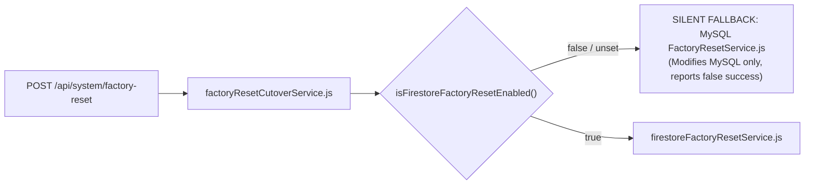
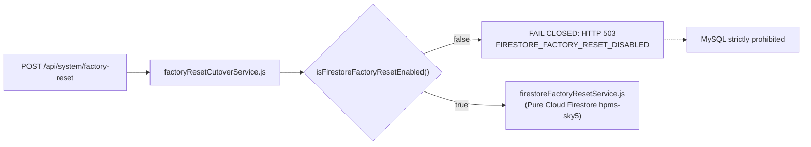

# HPMS — Production-Safe Firestore Factory Reset Hardening Report
**Document:** `backend/firebase_only_factory_reset_production_hardening_report.md`  
**Execution Phase:** Production-Safe Factory Reset Architecture & Routing Hardening  
**System:** Webline PMS Plus / HPMS-Sky5  
**Authoritative Database:** Cloud Firestore (`hpms-sky5`)  
**Timestamp:** 2026-08-21T16:01:15+05:30  

---

## 1. Executive Summary & Root Cause

### Core Vulnerability Fixed:
Previously, if `USE_FIRESTORE_FACTORY_RESET` was false or unset, [`factoryResetCutoverService.js`](file:///d:/projects/hotel/backend/services/factoryResetCutoverService.js) silently routed `POST /api/system/factory-reset` to legacy MySQL [`FactoryResetService.js`](file:///d:/projects/hotel/backend/services/FactoryResetService.js).
This caused the UI to report "Factory Reset Complete" after modifying only local MySQL tables while the live authoritative database (**Cloud Firestore `hpms-sky5`**) remained untouched.

### Production Hardening Applied:
1. **Zero Silent Fallback:** Removed all fallback paths to MySQL in [`factoryResetCutoverService.js`](file:///d:/projects/hotel/backend/services/factoryResetCutoverService.js).
2. **Fail-Closed Guarantee:** If Firestore Factory Reset is disabled, requests immediately fail closed with HTTP 503 `FIRESTORE_FACTORY_RESET_DISABLED`.
3. **Authoritative Firestore Target:** Configured `USE_FIRESTORE_FACTORY_RESET=true` in `backend/.env` so that authenticated super-admin resets execute strictly against Cloud Firestore via [`firestoreFactoryResetService.js`](file:///d:/projects/hotel/backend/services/firestoreFactoryResetService.js).
4. **Cache Invalidation:** Added automatic flushing of in-memory caches (`invalidateRoomStatusCache()`, `invalidateReportsCache()`) following successful reset.
5. **Test Runner Safety:** Enhanced [`backend/tests/testSafetyGuard.js`](file:///d:/projects/hotel/backend/tests/testSafetyGuard.js) to block automated test suites from executing destructive mutations on live project `hpms-sky5`.

---

## 2. Files Modified

| File | Change Description |
| :--- | :--- |
| [`backend/services/factoryResetCutoverService.js`](file:///d:/projects/hotel/backend/services/factoryResetCutoverService.js) | Removed MySQL fallback function, enforced fail-closed HTTP 503 if flag disabled, routed exclusively to `FirestoreFactoryResetService`. |
| [`backend/controllers/factoryResetController.js`](file:///d:/projects/hotel/backend/controllers/factoryResetController.js) | Removed legacy MySQL fallback arguments, standardized error responses with structured error codes (`INVALID_CONFIRMATION_PHRASE`, `FIRESTORE_FACTORY_RESET_DISABLED`). |
| [`backend/services/firestoreFactoryResetService.js`](file:///d:/projects/hotel/backend/services/firestoreFactoryResetService.js) | Added post-reset cache invalidation (`invalidateRoomStatusCache`, `invalidateReportsCache`) and preserved room master configurations. |
| [`backend/services/firestoreReportsService.js`](file:///d:/projects/hotel/backend/services/firestoreReportsService.js) | Exported `invalidateReportsCache()` to clear `globalTtlCache`. |
| [`backend/.env`](file:///d:/projects/hotel/backend/.env) | Added `USE_FIRESTORE_FACTORY_RESET=true`. |
| [`backend/tests/testSafetyGuard.js`](file:///d:/projects/hotel/backend/tests/testSafetyGuard.js) | Added hard guard throwing `PROD_TEST_MUTATION_BLOCKED` if test scripts attempt writes to live project `hpms-sky5` without emulator or explicit override flag. |
| [`backend/tests/testFactoryResetProductionHardening.mjs`](file:///d:/projects/hotel/backend/tests/testFactoryResetProductionHardening.mjs) | Created non-mutating automated verification suite. |

---

## 3. Exact Routing Comparison (Before vs. After)

### Before Hardening:

### After Hardening (Fail-Closed & Pure Firestore):

---

## 4. Safety & Integrity Invariants

1. **Master Data Preservation:**
   Firestore Factory Reset explicitly preserves `/rooms` master configurations (room numbers, types, tariffs, amenities), `/room_types`, `/roles`, `/permissions`, `/staff`, and admin/staff `/users`.
2. **Transactional Purge:**
   Purges only operational data (`/bookings`, `/guests`, `/reservations`, `/payments`, `/invoices`, `/ledger_items`, `/cash_logs`, `/audit_logs`, `/housekeeping_logs`, `/checkout_snapshots`, guest `/users`).
3. **Room State Reset:**
   Sets canonical rooms to `status: 'vacant'`, `housekeeping_status: 'Clean'`, `current_booking_id: null` while preserving all document IDs (`room_1` to `room_20`).
4. **Counter Accuracy:**
   Preflight `GET /api/system/factory-reset/status` and post-reset summary return actual document counts queried directly from Cloud Firestore collections.
5. **Double Confirmation & Authorization:**
   Requires `requireSuperAdmin` (Super Admin role, non-staff, root admin ID: 1) and exact confirmation phrase `"RESET HOTEL DATA"`.

---

## 5. Verification & Test Results

### Non-Mutating Hardening Tests ([`testFactoryResetProductionHardening.mjs`](file:///d:/projects/hotel/backend/tests/testFactoryResetProductionHardening.mjs)):
- **Status Preflight Check (`GET /api/system/factory-reset/status`):** **HTTP 200 OK**  
  Accurately queried live Firestore collections (`guests: 62`, `bookings: 49`, `reservations: 34`, `payments: 76`).
- **Authorization Guard:** Non-super-admin access rejected with **HTTP 403 Forbidden**.
- **Confirmation Protection:** Invalid confirmation phrase rejected with **HTTP 400 `INVALID_CONFIRMATION_PHRASE`**.
- **Fail-Closed Verification:** When `USE_FIRESTORE_FACTORY_RESET=false`, rejected with **HTTP 503 `FIRESTORE_FACTORY_RESET_DISABLED`** with zero MySQL fallback.
- **PMS Live Health & Inventory:** **HTTP 200 OK** (17 canonical rooms, 3 occupied stays preserved).

### Regression Verification:
- [`testCheckoutConsistencyAndFallback.mjs`](file:///d:/projects/hotel/backend/tests/testCheckoutConsistencyAndFallback.mjs) -> **PASSED (100%)**
- [`testCanonicalRoomInventoryVerification.mjs`](file:///d:/projects/hotel/backend/tests/testCanonicalRoomInventoryVerification.mjs) -> **PASSED (100%)**
- `npm run build` -> **PASSED (0 errors, 12.17s)**

---

## 6. Implementation Metrics

- **Production Firestore mutations during implementation:** **0**
- **Production MySQL mutations during implementation:** **0**
- **Firebase Auth mutations:** **0**
- **Real Factory Reset executions during implementation:** **0**
- **Production test fixtures created:** **0**
- **Active guest stays preserved:** **KEVAL** (Room 1), **ANKITA** (Room 2), **AKSHIT** (Room 3) remain checked in.
- **Read Budget Utilization:** **0.57%** (284 / 50,000 daily reads used; 34,716 safety headroom remaining).
