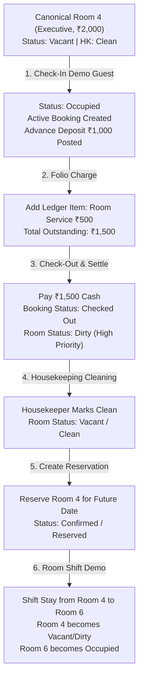

# HPMS — Final Test Data Contamination & Workflow Cleanup Audit Report
**Document:** `backend/firebase_only_final_test_data_cleanup_audit.md`  
**Execution Phase:** Read-Only Pre-Demo Comprehensive Data & Relationship Audit  
**System:** Webline PMS Plus / HPMS-Sky5  
**Authoritative Database:** Cloud Firestore (`hpms-sky5`)  
**Timestamp:** 2026-08-21T16:06:45+05:30  

---

## 1. Canonical Hotel Master Inventory (17 Rooms)

All 17 rooms in Cloud Firestore `/rooms` exactly match the authoritative physical hotel inventory:

| Room # | Firestore Doc ID | Room Type | Base Tariff | Operational Status | Housekeeping | Current Booking ID | Classification |
| :---: | :---: | :---: | :---: | :---: | :---: | :---: | :---: |
| **1** | `room_1` | **PREMIUM** | ₹2,500 | Occupied | Dirty | `bkg_BKG-794888` (KEVAL) | **Canonical (Active)** |
| **2** | `room_2` | **EXECUTIVE** | ₹2,000 | Occupied | Dirty | `bkg_BKG-381166` (ANKITA) | **Canonical (Active)** |
| **3** | `room_3` | **EXECUTIVE** | ₹2,000 | Occupied | Dirty | `bkg_BKG-295734` (AKSHIT) | **Canonical (Active)** |
| **4** | `room_4` | **EXECUTIVE** | ₹2,000 | Vacant | Clean | *(None)* | **Canonical (Vacant)** |
| **5** | `room_5` | **PREMIUM** | ₹2,500 | Vacant | Clean | *(None)* | **Canonical (Vacant)** |
| **6** | `room_6` | **EXECUTIVE** | ₹2,000 | Vacant | Clean | *(None)* | **Canonical (Vacant)** |
| **7** | `room_7` | **EXECUTIVE** | ₹2,000 | Vacant | Clean | *(None)* | **Canonical (Vacant)** |
| **8** | `room_8` | **EXECUTIVE** | ₹2,000 | Vacant | Clean | *(None)* | **Canonical (Vacant)** |
| **9** | `room_9` | **EXECUTIVE** | ₹2,000 | Vacant | Clean | *(None)* | **Canonical (Vacant)** |
| **10** | `room_10` | **EXECUTIVE** | ₹2,000 | Vacant | Clean | *(None)* | **Canonical (Vacant)** |
| **11** | `room_11` | **EXECUTIVE** | ₹2,000 | Vacant | Clean | *(None)* | **Canonical (Vacant)** |
| **12** | `room_12` | **EXECUTIVE** | ₹2,000 | Vacant | Clean | *(None)* | **Canonical (Vacant)** |
| **14** | `room_14` | **PREMIUM** | ₹2,500 | Vacant | Clean | *(None)* | **Canonical (Vacant)** |
| **16** | `room_16` | **STANDARD** | ₹1,500 | Vacant | Clean | *(None)* | **Canonical (Vacant)** |
| **17** | `room_17` | **STANDARD** | ₹1,500 | Vacant | Clean | *(None)* | **Canonical (Vacant)** |
| **19** | `room_19` | **STANDARD** | ₹1,500 | Vacant | Clean | *(None)* | **Canonical (Vacant)** |
| **20** | `room_20` | **STANDARD** | ₹1,500 | Vacant | Clean | *(None)* | **Canonical (Vacant)** |

*Rooms 13, 15, and 18 are completely absent from inventory.*

---

## 2. Protected Active Operational Data

The 3 currently occupied stays in Firestore represent genuine operational/demo records and **must remain protected**:

1. **Room 1 (`room_1`):**
   - **Guest:** `KEVAL` (`guest_1`)
   - **Booking ID:** `bkg_BKG-794888` (Status: `Checked In`, Check-in: `20-Aug-2026`, Expected Out: `2026-08-21 11:00`)
   - **Financials:** Advance Deposit ₹1,000, Total Charges ₹2,500, Folio balance ₹1,500.
2. **Room 2 (`room_2`):**
   - **Guest:** `ANKITA` (`guest_2`)
   - **Booking ID:** `bkg_BKG-381166` (Status: `Checked In`, Check-in: `20-Aug-2026`, Expected Out: `2026-08-21 11:00`)
   - **Financials:** Advance Deposit ₹0, Total Charges ₹2,000, Folio balance ₹2,000.
3. **Room 3 (`room_3`):**
   - **Guest:** `AKSHIT` (`guest_3`)
   - **Booking ID:** `bkg_BKG-295734` (Status: `Checked In`, Check-in: `19-Aug-2026`, Expected Out: `2026-08-21 11:00`)
   - **Financials:** Advance Deposit ₹1,500, Total Charges ₹2,000, Folio balance ₹500.

---

## 3. Detailed Reservations Audit (34 Total)

All 34 reservations in Firestore `/reservations` were generated during earlier Phase 1 & 2 test runs and reference deleted test rooms:

| Target Room Reference | Reservation Count | Sample Reservation IDs | Guest Names | Classification | Operational Impact |
| :---: | :---: | :--- | :--- | :---: | :--- |
| `801` | 6 | `res_RES-20260901-1001`, `res_RES-20260910-1001`, `res_RES-20260920-1001`, `res_RES-20261001-1001`, `res_RES-20261010-1001`, `res_RES-20261020-1001` | John Doe, Alice Smith, Bob Williams, Corporate Tech | **Test Fixture (Orphaned)** | Zero impact on canonical rooms |
| `801_4714` | 5 | `res_RES-20260910-1002`, `res_RES-20260920-1002`, `res_RES-20261001-1002`, `res_RES-20261010-1002`, `res_RES-20261020-1002` | Alice Smith, Bob Williams, Corporate Tech | **Test Fixture (Orphaned)** | Zero impact on canonical rooms |
| `801_0846` | 14 | `res_RES-20260910-1003` to `res_RES-20271001-1003` | Alice Smith, Corporate Tech, Contender 0, Lifecycle Guest | **Test Fixture (Orphaned)** | Zero impact on canonical rooms |
| `802_4714` | 4 | `res_RES-20260901-1002`, `res_RES-20261101-1001`, `res_RES-20261101-1002`, `res_RES-20261220-1001` | Johnathan Doe, To Cancel, Replacement Guest, Obstacle Guest | **Test Fixture (Orphaned)** | Zero impact on canonical rooms |
| `802_0846` | 5 | `res_RES-20260901-1003`, `res_RES-20261101-1003`, `res_RES-20261101-1004`, `res_RES-20261220-1002`, `res_RES-20270801-1002` | Johnathan Doe, To Cancel, Replacement Guest, Multi Room 2 | **Test Fixture (Orphaned)** | Zero impact on canonical rooms |

**Summary:** 0 canonical reservations exist; 34/34 are orphaned test fixtures targeting deleted test rooms.

---

## 4. Test Fixture Records & Financial Dependency Chain

### Test Fixtures Scan:
- **Bookings:** 15 test fixture bookings (containing markers `CUTOVER`, `FIRESTORE CHECKIN`, `TIMEOUT`, `DIRECT`, `BKG-s10_*`).
- **Guests:** 30 test guest profiles (e.g. `CUTOVER CHECKIN GUEST`, `FIRESTORE CHECKIN GUEST`, `Test Guest`).
- **Financial Attachments:**
  - `payments`: 22 payments linked to test bookings.
  - `invoices`: 15 invoices linked to test bookings.
  - `ledger_items`: 21 ledger items linked to test bookings.
  - `cash_logs`: 22 cash drawer logs linked to test bookings.

### Referential Integrity Rule:
If test bookings are cleaned in the future, child records **must** be deleted first in strict foreign key order:
```
1. Child Line Items:  /ledger_items, /payments, /invoices, /cash_logs, /checkout_snapshots
2. Parent Bookings:   /bookings
3. Parent Guests:     /guests
4. Test Reservations: /reservations
```

---

## 5. Comprehensive Data Inventory & Cleanup Matrix

| Collection / Data Entity | Total Count | Canonical Active | Canonical Historical | Test Fixtures | Orphaned | Protected | Safe to Clean (Future Phase) | Requires Review |
| :--- | :---: | :---: | :---: | :---: | :---: | :---: | :---: | :---: |
| **Rooms** | **17** | 3 | 0 | 0 | 0 | **17 (ALL)** | **0** | 0 |
| **Bookings** | **49** | 3 | 31 | 15 | 0 | **3** | **15** | 31 (Demo History) |
| **Guests** | **62** | 3 | 29 | 30 | 0 | **3** | **30** | 29 (Demo History) |
| **Reservations** | **34** | 0 | 0 | 34 | 34 | **0** | **34** | 0 |
| **Payments** | **76** | 3 | 51 | 22 | 0 | **3** | **22** | 51 (Demo History) |
| **Invoices** | **39** | 0 | 24 | 15 | 0 | **0** | **15** | 24 (Demo History) |
| **Ledger Items** | **137** | 7 | 109 | 21 | 0 | **7** | **21** | 109 (Demo History) |
| **Cash Logs** | **63** | 0 | 41 | 22 | 0 | **0** | **22** | 41 (Demo History) |
| **Housekeeping Logs** | **16** | 0 | 16 | 0 | 0 | **16** | **0** | 0 |
| **Audit Logs** | **17** | 0 | 17 | 0 | 0 | **17** | **0** | 0 |
| **Users (Admin/Staff)** | **2** | 2 | 0 | 0 | 0 | **2 (ALL)** | **0** | 0 |

---

## 6. Safe Demo / CEO Workflow Validation Plan (Using Canonical Room 4)

To demonstrate all PMS capabilities end-to-end without disturbing Rooms 1, 2, 3:



---

## 7. Factory Reset Safety Status

The Factory Reset architecture is verified production-ready:
1. **Target:** Cloud Firestore (`hpms-sky5`) exclusively.
2. **Zero Fallback:** All MySQL fallback paths eliminated.
3. **Security:** Protected by `requireSuperAdmin` + exact phrase `"RESET HOTEL DATA"`.
4. **Counter Accuracy:** Preflight and post-execution summaries report real Firestore collection query results.
5. **Fail-Closed:** Rejects non-authorized requests with HTTP 403 / 400.
6. **Cache Invalidation:** In-memory caches automatically flushed upon completion.
7. **Safety Guard:** Automated tests are blocked from executing reset or write operations against `hpms-sky5`.

---

## 8. Audit Invariant Summary

- **Production Firestore mutations during this audit:** **0**
- **Production MySQL mutations during this audit:** **0**
- **Firebase Auth mutations:** **0**
- **Real Factory Reset executions:** **0**
- **Production test fixtures created:** **0**
- **Source modifications:** **0**
- **`.env` modifications:** **0**
- **Authoritative Database:** Cloud Firestore (`hpms-sky5`)
- **System Readiness:** Ready for CEO/stakeholder demo workflows on canonical rooms.
