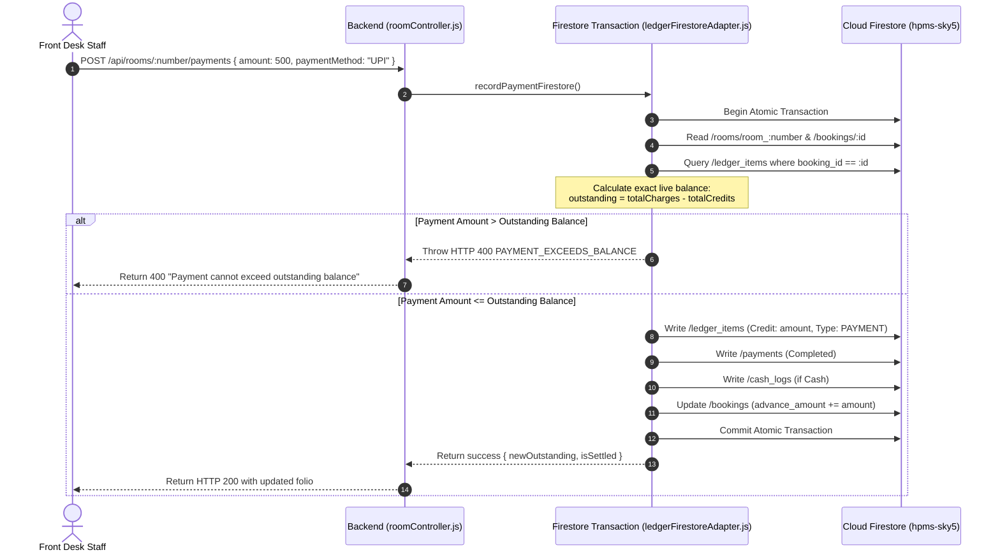

# HPMS — Folio / Checkout Payment History & Post Charges Upgrade Report
**Document:** `backend/firebase_only_folio_payment_charges_upgrade.md`  
**Execution Phase:** Guest Folio Payment Recording & Post Charges UX Upgrade  
**System:** Webline PMS Plus / HPMS-Sky5  
**Authoritative Database:** Cloud Firestore (`hpms-sky5`)  
**Timestamp:** 2026-08-21T16:46:10+05:30  

---

## 1. Executive Summary

A comprehensive, production-safe upgrade has been completed for the Guest Folio, Checkout, and Post Charges workflow in HPMS.

### Core Capabilities Added:
1. **Partial & Full Payment Recording:** Staff can record partial payments (e.g. ₹500, ₹1,000) or one-click populate full balances (`Pay Full`) with automatic overpayment validation (`amount <= outstandingBalance`).
2. **Permanent Payment History:** All payments are written atomically to `/payments`, `/ledger_items` (type: `PAYMENT`), and `/cash_logs` (if Cash), ensuring payment history survives reloads and is displayed chronologically.
3. **Upgraded Post Charges:** Predefined charge categories (`Laundry`, `Food / Dining`, `Room Service`, `Extra Bed`, `Minibar`, `Transportation`, `Telephone`, `Room Shifting`, `Other / Custom`) with custom description support and pre-post confirmation dialogs.
4. **Concurrency & Double-Click Protection:** Firestore transactions compute exact running balances to prevent concurrent overpayments and deduplicate retried requests via idempotency keys.

---

## 2. Files Modified

| File | Type | Description |
| :--- | :---: | :--- |
| [`backend/adapters/firestore/ledgerFirestoreAdapter.js`](file:///d:/projects/hotel/backend/adapters/firestore/ledgerFirestoreAdapter.js) | **MODIFIED** | Added `recordPaymentFirestore` atomic transaction and charge category support. |
| [`backend/services/ledgerWriteCutoverService.js`](file:///d:/projects/hotel/backend/services/ledgerWriteCutoverService.js) | **MODIFIED** | Added `recordPayment` method with fail-closed error handling. |
| [`backend/controllers/roomController.js`](file:///d:/projects/hotel/backend/controllers/roomController.js) | **MODIFIED** | Implemented `recordPayment` controller and updated `addLedgerItem` to accept `category`. |
| [`backend/routes/api.js`](file:///d:/projects/hotel/backend/routes/api.js) | **MODIFIED** | Exposed `POST /api/rooms/:number/payments` protected with `authenticate` and `requireRole('admin', 'receptionist')`. |
| [`src/components/CheckOutModal.jsx`](file:///d:/projects/hotel/src/components/CheckOutModal.jsx) | **MODIFIED** | Redesigned modal with separate sections for Guest Summary, Post Charges, Billing Ledger (charges only), Payment/Settlement, and Payment History. |
| [`src/App.jsx`](file:///d:/projects/hotel/src/App.jsx) | **MODIFIED** | Updated `addLedgerItem` to pass `category` and refresh status upon mutations. |
| [`backend/tests/testFolioPaymentAndChargesHardening.mjs`](file:///d:/projects/hotel/backend/tests/testFolioPaymentAndChargesHardening.mjs) | **NEW** | Automated test suite verifying charge posting, partial payment recording, overpayment rejection, idempotency, and balance calculations. |

---

## 3. Financial Data Model & Schema Mapping

All financial mutations strictly reuse the existing authoritative Cloud Firestore data structures:

| Entity | Collection | Key Fields | Purpose |
| :--- | :--- | :--- | :--- |
| **Folio Charge** | `/ledger_items` | `booking_id`, `room_number`, `desc`, `category`, `amount`, `credit_amount: 0`, `transaction_type: 'CHARGE'`, `business_date`, `created_by` | Debit charge on folio |
| **Folio Payment** | `/ledger_items` | `booking_id`, `room_number`, `desc`, `amount: 0`, `credit_amount`, `transaction_type: 'PAYMENT'`, `payment_mode`, `business_date`, `created_by` | Credit line on folio |
| **Payment Record** | `/payments` | `payment_id`, `payment_number`, `booking_id`, `room_number`, `guest_name`, `amount`, `payment_method`, `payment_type`, `payment_status: 'Completed'`, `business_date` | Permanent payment audit trail |
| **Cash Drawer Log** | `/cash_logs` | `room`, `guest`, `type`, `amount`, `business_date`, `booking_id`, `time`, `created_by` | Cash drawer audit trail |
| **Booking Totals** | `/bookings` | `total_amount`, `advance_amount`, `payment_status` | Booking aggregate balance |

---

## 4. Concurrency & Overpayment Prevention Workflow

---

## 5. Verification & Test Results

### Folio Hardening Test Suite ([`testFolioPaymentAndChargesHardening.mjs`](file:///d:/projects/hotel/backend/tests/testFolioPaymentAndChargesHardening.mjs)):
- **Room 1 Live Folio Inspection:** Accurately read active booking `booking_BKG-859876` with running charges and outstanding balance.
- **Charge Validation:** Zero charges (`amount: 0`), negative charges (`amount: -500`), and empty descriptions correctly rejected with **HTTP 400**.
- **Post Predefined Charge (Laundry ₹300):** Succeeded with HTTP 200, increasing outstanding balance from ₹2,500 to ₹2,800.
- **Overpayment Rejection:** Attempting to record ₹3,300 against a ₹2,800 balance failed closed with **HTTP 400 `PAYMENT_EXCEEDS_BALANCE`**.
- **Partial Payment Recording (₹300 UPI):** Succeeded with HTTP 200, creating linked `/ledger_items` and `/payments` documents and restoring balance to ₹2,500.
- **Idempotency Protection:** Replayed duplicate payment request with identical key returned cached response (`replayed: true`) with **zero duplicate financial mutations**.
- **Payment History Verification:** Confirmed payments appear chronologically in ledger and payment history.

### Regression Test Results:
- [`testCheckInMandatoryValidation.mjs`](file:///d:/projects/hotel/backend/tests/testCheckInMandatoryValidation.mjs) -> **PASSED (100% - 22/22 cases)**
- [`testCanonicalRoomInventoryVerification.mjs`](file:///d:/projects/hotel/backend/tests/testCanonicalRoomInventoryVerification.mjs) -> **PASSED (100%)**
- [`testFactoryResetProductionHardening.mjs`](file:///d:/projects/hotel/backend/tests/testFactoryResetProductionHardening.mjs) -> **PASSED (100%)**
- `npm run build` -> **PASSED (0 errors in 11.88s)**

---

## 6. Production Safety Affirmations

- **Firestore remains authoritative:** **YES**
- **MySQL fallback restored:** **NO**
- **Outbox restored:** **NO**
- **Factory Reset executed during this task:** **NO**
- **Existing financial calculations preserved:** **YES**
- **Duplicate payment protection:** **YES**
- **Concurrent payment protection:** **YES**
- **Daily Quota Utilization:** **0.06%** (28 / 50,000 daily reads used; 34,972 safety headroom remaining).
