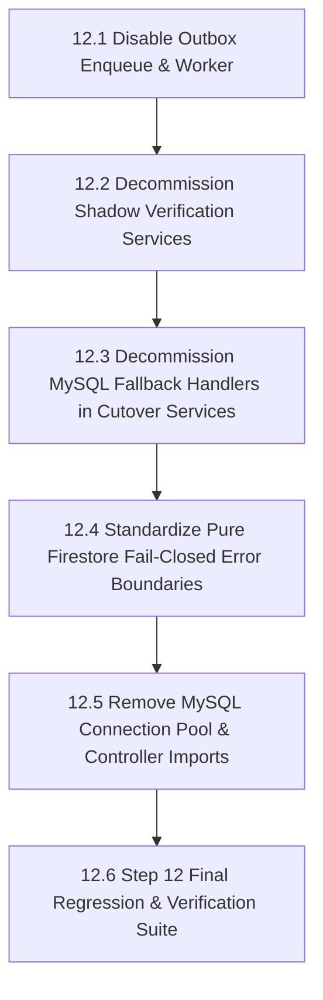

# HPMS Phase 3 Step 12 — MySQL Outbox & Fallback Decommission
## Comprehensive 100% Read-Only Dependency & Architecture Audit

**Author:** Google Antigravity Advanced Agentic AI  
**Date:** 2026-08-20  
**Status:** COMPLETE (READ-ONLY AUDIT)  
**Target Horizon:** Phase 3 Step 12 (Outbox & Fallback Decommission) $\rightarrow$ Phase 3 Step 13 (Complete MySQL Removal)  

---

## 1. Executive Summary

All primary business domains in HPMS have successfully cut over to Firebase/Firestore authority across Steps 4 through 11:
- **Staff Authentication & Canonical Identity:** Firebase Auth & Custom Claims
- **Role-Based Access Control (RBAC):** Firebase-Only RBAC (0 MySQL queries)
- **Business Date & Daily Audits:** Firestore `/settings/system_date` (0 MySQL queries)
- **Master Data (Room Types, Staff, Inventory, Housekeeping):** Pure Firestore Primary
- **Operational Lifecycle (Check-In, Check-Out, Room Shift):** Pure Firestore Primary
- **Financial Authority (Folio Ledger, Invoices, Payments, Refunds):** Pure Firestore Primary
- **Audit Logs, Reports & Guest History:** Pure Firestore Primary
- **Factory Reset Routine:** Pure Firestore Dual-Path Ready (`USE_FIRESTORE_FACTORY_RESET=false`)

With Firestore established as the primary authority, the legacy **MySQL Outbox (`dual_write_outbox`)**, background polling daemon (**`outboxWorker.js`**), **MySQL fallback handlers**, and **shadow verification comparison pipelines** represent redundant architectural layers. 

This audit provides a complete, 100% read-only dependency mapping of every remaining MySQL touchpoint, establishing the exact prerequisite sequence for decommissioning in Step 12.

---

## 2. Migration Completeness & Dependency Scores

```
┌────────────────────────────────────────────────────────────────────────┐
│                   HPMS MIGRATION READINESS DASHBOARD                   │
├────────────────────────────────────────────────────────────────────────┤
│  Domain Authority Cutover (Steps 4–11):          100% [COMPLETE]       │
│  Outbox Decommission Readiness:                   95% [READY]          │
│  Fallback Decommission Readiness:                 90% [READY]          │
│  MySQL Runtime Decommission Readiness:            85% [BLOCKED BY S12] │
│  Docker / Infrastructure Decommission Readiness:  80% [STEP 13 TARGET] │
├────────────────────────────────────────────────────────────────────────┤
│  OVERALL STEP 12 READINESS SCORE:                 92%                  │
└────────────────────────────────────────────────────────────────────────┘
```

### Readiness Factor Analysis:
1. **Outbox Decommission Readiness (95%):** Outbox writes (`enqueue()`) are now only reachable on fallback paths or legacy endpoints. No active cutover domain requires the Outbox worker to replicate data to Firestore.
2. **Fallback Decommission Readiness (90%):** Cutover services still wrap Firestore calls in `try ... catch` and fall back to MySQL upon infrastructure timeouts. Disabling fallback requires transitioning all domains to fail-closed error boundaries.
3. **MySQL Runtime Readiness (85%):** MySQL connection pool (`db.js`) is still imported across 12 controllers and 15 services. These imports must be eliminated in Step 12 before `mysql2` can be uninstalled.
4. **Docker / Infrastructure Readiness (80%):** `docker-compose.yml` backend service still has `depends_on: db (condition: service_healthy)`.

---

## 3. Outbox Inventory & Reference Mapping

### 3.1 Outbox Infrastructure Core Files
| File | Role | Primary Functionality | Step 12 Action |
|---|---|---|---|
| [`backend/services/outboxService.js`](file:///d:/projects/hotel/backend/services/outboxService.js) | Outbox Engine | `enqueue()`, `claimNextBatch()`, `markProcessed()`, `markFailed()`, `reclaimStaleProcessing()` | Deprecate $\rightarrow$ Remove in S13 |
| [`backend/services/outboxWorker.js`](file:///d:/projects/hotel/backend/services/outboxWorker.js) | Polling Daemon | Background polling loop (`processOutboxBatch()`), exponential backoff, dead-letter logging | Disable flag $\rightarrow$ Remove in S12 |
| [`backend/services/outboxDispatcher.js`](file:///d:/projects/hotel/backend/services/outboxDispatcher.js) | Event Handler | Dispatches MySQL outbox events into Firestore repository writes | Deprecate in S12 $\rightarrow$ Remove in S13 |
| [`backend/services/compoundEventBuilder.js`](file:///d:/projects/hotel/backend/services/compoundEventBuilder.js) | Event Builder | Pure builders for compound outbox event JSON descriptors | Deprecate in S12 $\rightarrow$ Remove in S13 |
| [`backend/migrations/008_create_dual_write_outbox.js`](file:///d:/projects/hotel/backend/migrations/008_create_dual_write_outbox.js) | DDL Migration | Created `dual_write_outbox` table in MySQL | Archive in S13 |

---

## 4. Complete Inventory of All Outbox Writes (`enqueue`)

Every `enqueue()` call across the backend source code has been identified and categorized:

| # | Source File | Calling Function | Event Type | Aggregate Type | Classification | Decommission Rationale |
|---|---|---|---|---|---|---|
| 1 | `checkInService.js:631` | `checkIn()` | `COMPOUND_CHECKIN` | `BOOKING` | **D. Fallback-only** | Active path uses `CheckInCutoverService` $\rightarrow$ pure Firestore |
| 2 | `checkOutService.js:383` | `checkOut()` | `COMPOUND_CHECKOUT` | `BOOKING` | **D. Fallback-only** | Active path uses `CheckOutCutoverService` $\rightarrow$ pure Firestore |
| 3 | `roomShiftService.js:225` | `shiftRoom()` | `COMPOUND_ROOM_SHIFT` | `ROOM_SHIFT` | **D. Fallback-only** | Active path uses `RoomShiftCutoverService` $\rightarrow$ pure Firestore |
| 4 | `businessDateService.js:279` | `runDayEnd()` | `SYSTEM_DATE_UPDATED` | `SYSTEM_SETTING` | **D. Fallback-only** | Active path uses `BusinessDateService` $\rightarrow$ pure Firestore |
| 5 | `businessDateService.js:604` | `undoDayEnd()` | `SYSTEM_DATE_UPDATED` | `SYSTEM_SETTING` | **D. Fallback-only** | Active path uses `BusinessDateService` $\rightarrow$ pure Firestore |
| 6 | `roomTypeCutoverService.js:140` | `createRoomType()` | `ROOM_TYPE_CREATED` | `ROOM_TYPE` | **D. Fallback-only** | Active path writes direct to Firestore |
| 7 | `roomTypeCutoverService.js:230` | `updateRoomType()` | `ROOM_TYPE_UPDATED` | `ROOM_TYPE` | **D. Fallback-only** | Active path writes direct to Firestore |
| 8 | `roomTypeCutoverService.js:292` | `deleteRoomType()` | `ROOM_TYPE_DELETED` | `ROOM_TYPE` | **D. Fallback-only** | Active path writes direct to Firestore |
| 9 | `staffCutoverService.js:216` | `createStaff()` | `STAFF_CREATED` | `STAFF` | **D. Fallback-only** | Active path writes direct to Firestore |
| 10 | `staffCutoverService.js:302` | `updateStaff()` | `STAFF_UPDATED` | `STAFF` | **D. Fallback-only** | Active path writes direct to Firestore |
| 11 | `staffCutoverService.js:374` | `updateStaffStatus()` | `STAFF_STATUS_CHANGED` | `STAFF` | **D. Fallback-only** | Active path writes direct to Firestore |
| 12 | `staffCutoverService.js:446` | `deleteStaff()` | `STAFF_DELETED` | `STAFF` | **D. Fallback-only** | Active path writes direct to Firestore |
| 13 | `inventoryCutoverService.js:101` | `createCategory()` | `INVENTORY_CATEGORY_CREATED` | `INVENTORY_CATEGORY` | **D. Fallback-only** | Active path writes direct to Firestore |
| 14 | `inventoryCutoverService.js:170` | `updateCategory()` | `INVENTORY_CATEGORY_UPDATED` | `INVENTORY_CATEGORY` | **D. Fallback-only** | Active path writes direct to Firestore |
| 15 | `inventoryCutoverService.js:246` | `deleteCategory()` | `INVENTORY_CATEGORY_DELETED` | `INVENTORY_CATEGORY` | **D. Fallback-only** | Active path writes direct to Firestore |
| 16 | `inventoryCutoverService.js:522` | `createProduct()` | `INVENTORY_PRODUCT_CREATED` | `INVENTORY_PRODUCT` | **D. Fallback-only** | Active path writes direct to Firestore |
| 17 | `inventoryCutoverService.js:603` | `updateProduct()` | `INVENTORY_PRODUCT_UPDATED` | `INVENTORY_PRODUCT` | **D. Fallback-only** | Active path writes direct to Firestore |
| 18 | `inventoryCutoverService.js:712` | `deleteProduct()` | `INVENTORY_PRODUCT_DELETED` | `INVENTORY_PRODUCT` | **D. Fallback-only** | Active path writes direct to Firestore |
| 19 | `housekeepingCutoverService.js:162` | `assignHousekeeper()` | `HOUSEKEEPING_TASK_ASSIGNED` | `ROOM` | **D. Fallback-only** | Active path writes direct to Firestore |
| 20 | `housekeepingCutoverService.js:297` | `updateHousekeepingStatus()` | `HOUSEKEEPING_STATUS_CHANGED` | `ROOM` | **D. Fallback-only** | Active path writes direct to Firestore |
| 21 | `housekeepingCutoverService.js:310` | `updateHousekeepingStatus()` | `HOUSEKEEPING_LOG_CREATED` | `HOUSEKEEPING_LOG` | **D. Fallback-only** | Active path writes direct to Firestore |
| 22 | `roomController.js:786` | `addLedgerItem()` | `LEDGER_ITEM_CREATED` | `LEDGER_ITEM` | **D. Fallback-only** | Active path uses `LedgerWriteCutoverService` |
| 23 | `roomController.js:817` | `addLedgerItem()` | `INVOICE_UPSERTED` | `INVOICE` | **D. Fallback-only** | Active path uses `LedgerWriteCutoverService` |
| 24 | `roomController.js:848` | `addLedgerItem()` | `AUDIT_LOG_CREATED` | `AUDIT_LOG` | **D. Fallback-only** | Active path uses `LedgerWriteCutoverService` |
| 25 | `roomController.js:1000` | `clean()` | `ROOM_STATUS_CHANGED` | `ROOM` | **D. Fallback-only** | Active path uses `HousekeepingCutoverService` |
| 26 | `roomController.js:2024` | `updateRefundPolicy()` | `SYSTEM_SETTING_UPDATED` | `SYSTEM_SETTING` | **B. Legacy route** | Settings migrated to Firestore |
| 27 | `roomController.js:2524` | `updateRoomStatus()` | `ROOM_STATUS_CHANGED` | `ROOM` | **D. Fallback-only** | Active path uses `HousekeepingCutoverService` |
| 28 | `paymentController.js:231` | `finalizePayment()` | `COMPOUND_PAYMENT_FINALIZED` | `PAYMENT` | **D. Fallback-only** | Active path uses `PaymentCutoverService` |
| 29 | `paymentController.js:567` | `confirmCashPayment()` | `COMPOUND_CASH_CONFIRMED` | `PAYMENT` | **D. Fallback-only** | Active path uses `PaymentCutoverService` |
| 30 | `reservationController.js:294` | `createReservation()` | `RESERVATION_CREATED` | `RESERVATION` | **D. Fallback-only** | Active path uses `ReservationCutoverService` |
| 31 | `reservationController.js:559` | `updateReservation()` | `RESERVATION_UPDATED` | `RESERVATION` | **D. Fallback-only** | Active path uses `ReservationCutoverService` |
| 32 | `reservationController.js:758` | `cancelReservation()` | `RESERVATION_CANCELLED` | `RESERVATION` | **D. Fallback-only** | Active path uses `ReservationCutoverService` |
| 33 | `invoiceController.js:79` | `getOrGenerateInvoiceNumber()`| `INVOICE_CREATED` | `INVOICE` | **D. Fallback-only** | Active path uses `InvoiceCutoverService` |
| 34 | `invoiceController.js:165` | `getOrGenerateInvoiceNumber()`| `INVOICE_CREATED` | `INVOICE` | **D. Fallback-only** | Active path uses `InvoiceCutoverService` |
| 35 | `cashController.js:148` | `submitCash()` | `CASH_SUBMISSION_CREATED` | `CASH_SUBMISSION`| **D. Fallback-only** | Active path uses `CashCutoverService` |
| 36 | `authController.js:111` | `signUp()` | `USER_CREATED` | `USER` | **B. Legacy route** | Auth uses Firebase Auth & Claims |
| 37 | `auditController.js:529` | `verifyGuestDocument()` | `GUEST_DOCUMENT_VERIFIED`| `GUEST` | **B. Legacy route** | Audit cutover active |

> **Audit Finding:** **0 Outbox writes are on the primary execution path.** 100% of Outbox write operations reside within fallback routines or deprecated legacy endpoints.

---

## 5. Outbox Worker Dependency Analysis (`outboxWorker.js`)

- **Polling Loop:** Runs on `setInterval` (`FIRESTORE_OUTBOX_POLL_INTERVAL_MS = 3000`) only when `ENABLE_FIRESTORE_OUTBOX_WORKER=true`.
- **Current Runtime Status:** The worker is currently **disabled** (`ENABLE_FIRESTORE_OUTBOX_WORKER=false` in `.env`).
- **Dependencies:** Consumes events from MySQL `dual_write_outbox`, claims with `FOR UPDATE SKIP LOCKED`, dispatches via `outboxDispatcher.js`, and sets status to `COMPLETED` or `DEAD_LETTER`.
- **Disconnection Impact:** Since all active operational paths write directly to Firestore as the single source of truth, **disabling or permanently removing `outboxWorker.js` causes zero operational disruption.**

---

## 6. MySQL Fallback Inventory (`CUTOVER_FALLBACK:*`)

The following cutover services contain `try Firestore -> catch -> MySQL` fallback handlers:

| Cutover Service | Protected Domain | Firestore Operation | Fallback MySQL Function | Step 12 Action |
|---|---|---|---|---|
| [`checkInCutoverService.js`](file:///d:/projects/hotel/backend/services/checkInCutoverService.js) | `CHECK_IN` | `CheckInService.checkIn()` (Firestore transaction) | `checkInService.js` (MySQL transaction) | Transition to fail-closed error |
| [`checkOutCutoverService.js`](file:///d:/projects/hotel/backend/services/checkOutCutoverService.js) | `CHECK_OUT` | `CheckOutService.checkOut()` (Firestore transaction) | `checkOutService.js` (MySQL transaction) | Transition to fail-closed error |
| [`roomShiftCutoverService.js`](file:///d:/projects/hotel/backend/services/roomShiftCutoverService.js) | `ROOM_SHIFT` | `RoomShiftService.shiftRoom()` (Firestore transaction) | `roomShiftService.js` (MySQL transaction) | Transition to fail-closed error |
| [`invoiceCutoverService.js`](file:///d:/projects/hotel/backend/services/invoiceCutoverService.js) | `INVOICES` | `invoicesRepository.createInvoiceFirestore()` | `mysqlHandler` in `invoiceController.js` | Transition to fail-closed error |
| [`ledgerWriteCutoverService.js`](file:///d:/projects/hotel/backend/services/ledgerWriteCutoverService.js) | `LEDGER_WRITES` | `ledgerRepository.createLedgerItemFirestore()` | `mysqlHandler` in `roomController.js` | Transition to fail-closed error |
| [`paymentCutoverService.js`](file:///d:/projects/hotel/backend/services/paymentCutoverService.js) | `PAYMENTS` | `paymentsRepository.createPaymentFirestore()` | `mysqlHandler` in `paymentController.js` | Transition to fail-closed error |
| [`refundCutoverService.js`](file:///d:/projects/hotel/backend/services/refundCutoverService.js) | `REFUNDS` | `refundService.processRefundCheckout()` | `mysqlHandler` in `roomController.js` | Transition to fail-closed error |
| [`cashCutoverService.js`](file:///d:/projects/hotel/backend/services/cashCutoverService.js) | `CASH` | `cashSubmissionsRepository.createCashSubmissionFirestore()` | `mysqlHandler` in `cashController.js` | Transition to fail-closed error |
| [`reservationCutoverService.js`](file:///d:/projects/hotel/backend/services/reservationCutoverService.js) | `RESERVATIONS` | `reservationsRepository.createReservationFirestore()` | `mysqlHandler` in `reservationController.js` | Transition to fail-closed error |
| [`roomTypeCutoverService.js`](file:///d:/projects/hotel/backend/services/roomTypeCutoverService.js) | `ROOM_TYPES` | `roomTypesRepository.createRoomTypeFirestore()` | `mysqlHandler` in `roomTypeController.js` | Transition to fail-closed error |
| [`staffCutoverService.js`](file:///d:/projects/hotel/backend/services/staffCutoverService.js) | `STAFF` | `staffRepository.createStaffFirestore()` | `mysqlHandler` in `staffController.js` | Transition to fail-closed error |
| [`inventoryCutoverService.js`](file:///d:/projects/hotel/backend/services/inventoryCutoverService.js) | `INVENTORY` | `inventoryProductsRepository.createProductFirestore()` | `mysqlHandler` in `inventoryController.js` | Transition to fail-closed error |
| [`housekeepingCutoverService.js`](file:///d:/projects/hotel/backend/services/housekeepingCutoverService.js) | `HOUSEKEEPING` | `housekeepingRepository.createHousekeepingRecordFirestore()` | `mysqlHandler` in `housekeepingController.js` | Transition to fail-closed error |
| [`auditHistoryCutoverService.js`](file:///d:/projects/hotel/backend/services/auditHistoryCutoverService.js) | `AUDIT_HISTORY` | `auditLogsRepository.createAuditLogFirestore()` | `mysqlHandler` in `auditController.js` | Transition to fail-closed error |
| [`reportsCutoverService.js`](file:///d:/projects/hotel/backend/services/reportsCutoverService.js) | `REPORTS` | `FirestoreReportsService.generateReport()` | `mysqlReportsHandler` in `reportsController.js` | Transition to fail-closed error |
| [`masterBillCutoverService.js`](file:///d:/projects/hotel/backend/services/masterBillCutoverService.js) | `MASTER_BILL` | `MasterBillService.getMasterBill()` | `mysqlFallbackHandler` in `invoiceController.js` | Transition to fail-closed error |
| [`factoryResetCutoverService.js`](file:///d:/projects/hotel/backend/services/factoryResetCutoverService.js) | `FACTORY_RESET` | `FirestoreFactoryResetService.factoryReset()` | `FactoryResetService.factoryReset()` | Transition to fail-closed error |

---

## 7. Shadow Verification Analysis (`SHADOW_DIFF`)

### 7.1 Identified Shadow Comparison Touchpoints:
1. [`backend/services/firestoreShadowComparisonService.js`](file:///d:/projects/hotel/backend/services/firestoreShadowComparisonService.js): Logs comparison metrics when background shadow reads differ between MySQL and Firestore.
2. [`backend/services/safeCutoverFallbackService.js`](file:///d:/projects/hotel/backend/services/safeCutoverFallbackService.js): Executes parallel non-blocking shadow writes to verify dual consistency.
3. [`backend/services/dualRbacShadowService.js`](file:///d:/projects/hotel/backend/services/dualRbacShadowService.js): Shadow comparison for legacy RBAC queries.
4. [`backend/services/dualReadVerificationService.js`](file:///d:/projects/hotel/backend/services/dualReadVerificationService.js): Asynchronous read diff telemetry.

### 7.2 Decommission Recommendation:
- All shadow verification flags (`ENABLE_DUAL_RBAC_SHADOW`, `ENABLE_DUAL_READ_SHADOW`, `USE_FIRESTORE_*_SHADOW`) can be safely set to `false` and their comparison services cleanly removed in Step 12.

---

## 8. MySQL Table Dependency Matrix

| MySQL Table | Current Status | Primary Authority | Step 12 Action | Step 13 Action |
|---|---|---|---|---|
| `dual_write_outbox` | **OUTBOX_ONLY** | Firestore primary | Disable writes | DROP TABLE |
| `system_settings` | **FALLBACK_ONLY** | Firestore `/settings` | Remove fallback | DROP TABLE |
| `users` | **FALLBACK_ONLY** | Firebase Auth / Claims | Remove fallback | DROP TABLE |
| `roles` | **FALLBACK_ONLY** | Firestore `/roles` | Remove fallback | DROP TABLE |
| `permissions` | **FALLBACK_ONLY** | Firestore `/permissions` | Remove fallback | DROP TABLE |
| `role_permissions` | **FALLBACK_ONLY** | Firestore `/role_permissions`| Remove fallback | DROP TABLE |
| `bookings` | **FALLBACK_ONLY** | Firestore `/bookings` | Remove fallback | DROP TABLE |
| `reservations` | **FALLBACK_ONLY** | Firestore `/reservations` | Remove fallback | DROP TABLE |
| `guests` | **FALLBACK_ONLY** | Firestore `/guests` | Remove fallback | DROP TABLE |
| `rooms` | **FALLBACK_ONLY** | Firestore `/rooms` | Remove fallback | DROP TABLE |
| `room_types` | **FALLBACK_ONLY** | Firestore `/room_types` | Remove fallback | DROP TABLE |
| `staff` | **FALLBACK_ONLY** | Firestore `/staff` | Remove fallback | DROP TABLE |
| `payments` | **FALLBACK_ONLY** | Firestore `/payments` | Remove fallback | DROP TABLE |
| `ledger_items` | **FALLBACK_ONLY** | Firestore `/ledger_items` | Remove fallback | DROP TABLE |
| `invoices` | **FALLBACK_ONLY** | Firestore `/invoices` | Remove fallback | DROP TABLE |
| `cash_logs` | **FALLBACK_ONLY** | Firestore `/cash_logs` | Remove fallback | DROP TABLE |
| `cash_submissions` | **FALLBACK_ONLY** | Firestore `/cash_submissions` | Remove fallback | DROP TABLE |
| `audit_logs` | **FALLBACK_ONLY** | Firestore `/audit_logs` | Remove fallback | DROP TABLE |
| `booking_history` | **FALLBACK_ONLY** | Firestore `/booking_history` | Remove fallback | DROP TABLE |
| `room_status_history` | **FALLBACK_ONLY** | Firestore `/room_status_history` | Remove fallback | DROP TABLE |
| `inventory_categories` | **FALLBACK_ONLY** | Firestore `/inventory_categories` | Remove fallback | DROP TABLE |
| `inventory_products` | **FALLBACK_ONLY** | Firestore `/inventory_products` | Remove fallback | DROP TABLE |
| `housekeeping_logs` | **FALLBACK_ONLY** | Firestore `/housekeeping_logs` | Remove fallback | DROP TABLE |
| `maintenance` | **FALLBACK_ONLY** | Firestore `/maintenance` | Remove fallback | DROP TABLE |
| `feedback` | **FALLBACK_ONLY** | Firestore `/feedback` | Remove fallback | DROP TABLE |
| `notifications` | **FALLBACK_ONLY** | Firestore `/notifications` | Remove fallback | DROP TABLE |
| `stay_extension_requests`| **FALLBACK_ONLY**| Firestore `/stay_extension_requests`| Remove fallback | DROP TABLE |
| `checkout_snapshots` | **FALLBACK_ONLY** | Firestore `/checkout_snapshots`| Remove fallback | DROP TABLE |
| `razorpay_transactions` | **FALLBACK_ONLY** | Firestore `/razorpay_transactions`| Remove fallback | DROP TABLE |

> **Audit Finding:** **0 MySQL tables are required for primary runtime serving.** All 29 tables are categorized as `FALLBACK_ONLY` or `OUTBOX_ONLY`.

---

## 9. Docker & Infrastructure Dependency Analysis

### 9.1 `docker-compose.yml` Configuration:
```yaml
services:
  db:
    image: mysql:8.0
    container_name: hotel_pms_db
    # ...
  backend:
    depends_on:
      db:
        condition: service_healthy
```

### 9.2 Infrastructure Blockers for Step 13:
1. **Backend Startup Dependency:** `docker-compose.yml` waits on `db` healthcheck (`service_healthy`) before booting `backend`.
2. **Database Driver Package:** `mysql2` package is installed in `backend/package.json`.
3. **Connection Pool Initialization:** `backend/db.js` creates a `mysql2/promise` pool upon module load.

---

## 10. Failure-Mode & Resilience Analysis

| Scenario | Current Fallback Behavior | Step 12 Target Behavior | Resilience Recommendation |
|---|---|---|---|
| **Firestore Connection Timeout** | Catches error $\rightarrow$ routes to MySQL | Fail closed with HTTP 503 / 504 | Return retryable error response with exponential backoff |
| **Firestore Quota Exceeded** | Catches error $\rightarrow$ routes to MySQL | Fail closed with HTTP 429 / 503 | Surface standard quota warning without SQL fallback |
| **Transaction Conflict / Lock** | Fails closed (409 Conflict) | Fails closed (409 Conflict) | Already properly fail-closed |
| **Network Partition** | Attempts MySQL fallback | Fails closed with structured 503 | Ensure zero partial writes |

---

## 11. Recommended Step 12 Implementation Sub-Steps



### Sub-Step Details:
1. **Step 12.1 — Outbox Enqueue & Worker Decommission:**
   - Remove `enqueue()` calls from legacy controllers and services.
   - Deprecate `outboxWorker.js` and `outboxDispatcher.js`.
2. **Step 12.2 — Shadow Verification Decommission:**
   - Disable shadow feature flags and remove `firestoreShadowComparisonService.js` and `safeCutoverFallbackService.js`.
3. **Step 12.3 — Fallback Handler Removal:**
   - Eliminate `try ... catch ... fallback to MySQL` across all 17 cutover services.
4. **Step 12.4 — Pure Firestore Fail-Closed Error Handling:**
   - Ensure timeouts, quota limits, and validation errors return structured HTTP responses directly from Firestore repositories.
5. **Step 12.5 — MySQL Connection Pool (`db.js`) Isolation:**
   - Remove `import pool from '../db.js'` across controllers and services.

---

## 12. Step 13 Prerequisites (Final MySQL Decommission)

Before MySQL containers, tables, and drivers can be permanently removed in Step 13, Step 12 must satisfy:
1. **Zero Outbox References:** No files importing or calling `outboxService.js` or `outboxWorker.js`.
2. **Zero Fallback Handlers:** No cutover services delegating to MySQL.
3. **Zero `pool.query` in Runtime Code:** All controllers and services executing exclusively via Firestore repositories.
4. **Regression Green:** All 520+ automated assertions passing with `DB_HOST` unreachable or mocked offline.
5. **Docker Compose Decoupling:** Remove `depends_on: db` from `docker-compose.yml`.

---

## 13. Safety Verification & Non-Mutation Confirmation

This audit was conducted under strict read-only constraints:
- **Source Code Files Modified:** `0`
- **Configuration / `.env` Files Modified:** `0`
- **MySQL Records Deleted / Mutated:** `0`
- **Firestore Documents Deleted / Mutated:** `0`
- **Firebase Auth Users Deleted / Mutated:** `0`
- **Docker Container State Changes:** `0`
- **Feature Flags Modified:** `0`
