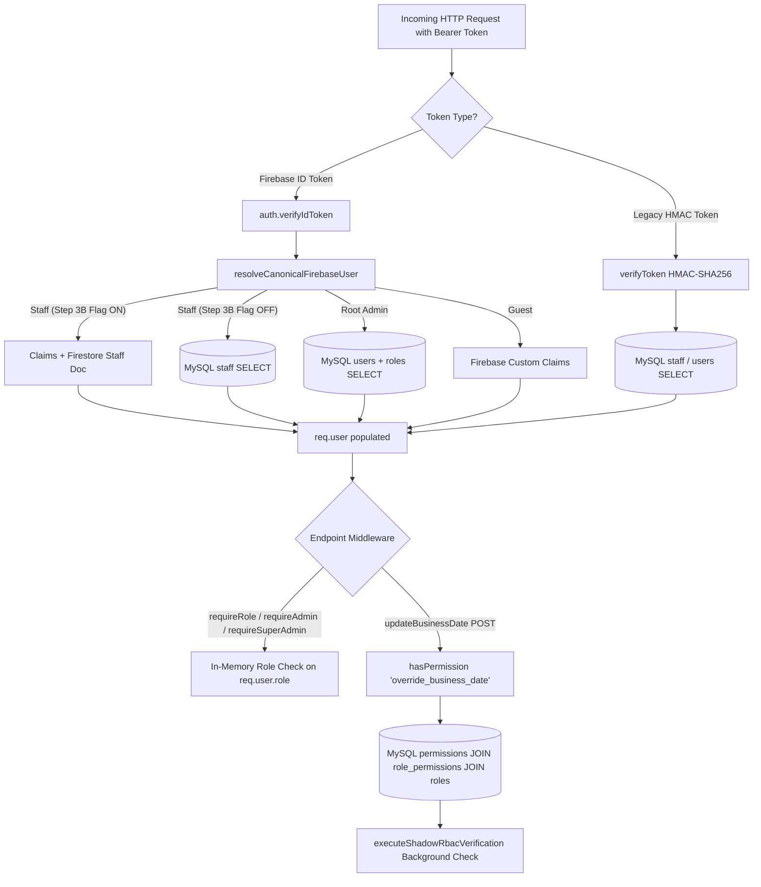
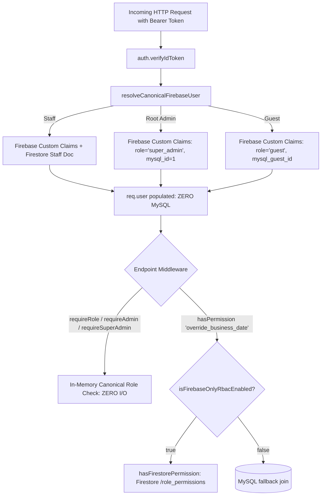

# HPMS Phase 3 Step 4 — RBAC Firebase-Only Read-Only Audit Report

**Date:** 2026-08-20  
**Phase:** Phase 3 — Step 4 (RBAC & Authorization Audit)  
**Execution Mode:** 100% Read-Only Static & Architectural Audit  
**Status:** AUDIT COMPLETED — PENDING APPROVAL

---

## 1. Executive Summary & Verification Metrics

This audit analyzes the complete role-based access control (RBAC) and permission authorization topology of the Hotel Property Management System (HPMS-Sky5) backend and frontend.

The primary objective is to identify **all remaining MySQL dependencies for role and permission resolution**, determine whether Firebase Custom Claims and Firestore RBAC can completely replace those reads, document any architectural/security blockers, and outline the exact implementation sub-steps for Phase 3 Step 4.

```
========================================================================================
                       PHASE 3 STEP 4 AUDIT METRICS
========================================================================================
 MySQL mutations                : 0
 MySQL schema changes           : 0
 Firebase Auth mutations        : 0
 Firestore mutations            : 0
 Source files modified          : 0
 Active feature flags modified  : 0
 Operational State              : MySQL 100% Authoritative (No behavior altered)
========================================================================================
```

---

## 2. Complete MySQL RBAC Dependency Inventory

### 2.1 Complete Catalog of MySQL Queries for RBAC / Role / Permission Resolution

| Location | MySQL Query / Operation | Purpose / Context | Replacement Path | Risk Level |
|---|---|---|---|---|
| `backend/controllers/authController.js:949-955` | `SELECT p.id FROM permissions p JOIN role_permissions rp ON p.id = rp.permission_id JOIN roles r ON rp.role_id = r.id WHERE LOWER(r.name) = ? AND p.name = ?` | `hasPermission(req, permissionName)` — checks permission for a role (invoked by `settingsController.updateBusinessDate`) | `hasFirestorePermission()` in `rbacRepository.js` | **LOW** |
| `backend/controllers/authController.js:766-773` | `SELECT u.id, u.username, u.fullName, r.name as role FROM users u LEFT JOIN roles r ON u.role_id = r.id WHERE u.id = ? OR u.username = 'admin' LIMIT 1` | `resolveCanonicalFirebaseUser` for Root Admin (`user_1` / `mysql_id=1`) | Sourced from verified Firebase Claims `{ role: 'super_admin', mysql_id: 1, isRootAdmin: true }` | **LOW** |
| `backend/controllers/authController.js:724-728` | `SELECT id, username, full_name, role, department, shift, status, deleted FROM staff WHERE (id = ? OR username = ?) AND deleted = 0 LIMIT 1` | `resolveCanonicalFirebaseUser` for Staff (Flag-OFF fallback) | Handled in Step 3B via claims + Firestore staff document lookup | **LOW** |
| `backend/controllers/authController.js:74` | `SELECT id FROM roles WHERE name = 'guest'` | `signUp` — obtains `role_id` for inserting into MySQL `users` table | Sourced from Firestore or static role id constant `2` (signup write path) | **LOW** |
| `backend/controllers/authController.js:314-320` | `SELECT u.id, u.username, u.fullName, u.phone, u.password, r.name as role, g.loyalty_tier, g.loyalty_points FROM users u LEFT JOIN roles r ON u.role_id = r.id LEFT JOIN guests g ON g.user_id = u.id WHERE ...` | `signIn` — Legacy user password authentication | N/A (Isolated to legacy fallback when Firebase Login flag is OFF) | **LOW** |
| `backend/controllers/authController.js:888-891` | `SELECT status, deleted FROM staff WHERE (id = ? OR username = ?) AND deleted = 0 LIMIT 1` | `authenticate` — Legacy HMAC token status check for staff | N/A (Isolated to legacy fallback) | **LOW** |
| `backend/controllers/authController.js:1107-1111` | `SELECT id, username, full_name, role, department, shift, status, deleted FROM staff WHERE (id = ? OR username = ?) AND deleted = 0 LIMIT 1` | `getMe` — Legacy HMAC token staff profile resolution | N/A (Isolated to legacy fallback) | **LOW** |
| `backend/services/dualRbacVerificationService.js:30,61` | `SELECT id FROM roles WHERE LOWER(name) = ? LIMIT 1` | `hasMysqlPermission()`, `getMysqlPermissionsForRole()` | Verification-only helper (Phase 2 Step 7 parity harness) | **NONE** |

---

## 3. Existing Firestore Role & Permission Master Data

During **Phase 2 Step 7**, all MySQL RBAC master data was mirrored to Firestore. Parity was verified with 100% fidelity across all entities.

### 3.1 Firestore Collections & Documents

1. **`/roles` Collection (2 documents):**
   - `/roles/role_admin`: `{ role_id: 1, name: "admin", description: "System Administrator with full access", mysql_role_id: 1 }`
   - `/roles/role_guest`: `{ role_id: 2, name: "guest", description: "Standard Guest Customer account", mysql_role_id: 2 }`

2. **`/permissions` Collection (7 documents):**
   - `/permissions/perm_view_dashboard`: `{ permission_id: 1, name: "view_dashboard", mysql_permission_id: 1 }`
   - `/permissions/perm_manage_rooms`: `{ permission_id: 2, name: "manage_rooms", mysql_permission_id: 2 }`
   - `/permissions/perm_manage_bookings`: `{ permission_id: 3, name: "manage_bookings", mysql_permission_id: 3 }`
   - `/permissions/perm_run_audit`: `{ permission_id: 4, name: "run_audit", mysql_permission_id: 4 }`
   - `/permissions/perm_make_payment`: `{ permission_id: 5, name: "make_payment", mysql_permission_id: 5 }`
   - `/permissions/perm_modify_business_date`: `{ permission_id: 6, name: "modify_business_date", mysql_permission_id: 6 }`
   - `/permissions/perm_override_business_date`: `{ permission_id: 7, name: "override_business_date", mysql_permission_id: 7 }`

3. **`/role_permissions` Collection (9 documents):**
   - Admin Mappings (7):
     - `/role_permissions/rp_admin_view_dashboard`
     - `/role_permissions/rp_admin_manage_rooms`
     - `/role_permissions/rp_admin_manage_bookings`
     - `/role_permissions/rp_admin_run_audit`
     - `/role_permissions/rp_admin_make_payment`
     - `/role_permissions/rp_admin_modify_business_date`
     - `/role_permissions/rp_admin_override_business_date`
   - Guest Mappings (2):
     - `/role_permissions/rp_guest_view_dashboard`
     - `/role_permissions/rp_guest_make_payment`

---

## 4. Current Authorization Flow vs. Firebase-Only Flow

### 4.1 Current Authorization Flow (Mixed Mode)



### 4.2 Target Firebase-Only Authorization Flow (Phase 3 Step 4)



---

## 5. Analysis of Blockers for Removing MySQL RBAC

1. **`hasPermission()` Implementation Hardcoded to MySQL:**
   - In `backend/controllers/authController.js:946`, `hasPermission` unconditionally executes `pool.query(SELECT FROM permissions ... JOIN role_permissions ... JOIN roles)`.
   - **Resolution:** Route `hasPermission` through `hasFirestorePermission()` from `backend/repositories/firestore/rbacRepository.js` when `isFirebaseOnlyRbacEnabled() === true`.

2. **Root Admin Resolution Hardcoded to MySQL `users` Table:**
   - In `backend/controllers/authController.js:766`, `resolveCanonicalFirebaseUser` executes `SELECT FROM users WHERE u.id = ? OR u.username = 'admin'`.
   - **Resolution:** In Step 4, when `ENABLE_FIREBASE_ONLY_RBAC=true` (or `ENABLE_FIREBASE_ONLY_STAFF_RESOLUTION=true`), resolve `user_1` directly from claims `{ id: 1, mysql_id: 1, role: 'admin', isRootAdmin: true, type: 'admin' }` with 0 MySQL queries.

3. **Absence of Permissions in Firebase Custom Claims:**
   - Custom claims currently contain only roles (`role: 'admin'`, `role: 'guest'`, etc.) and user metadata.
   - **Resolution:** Keep permissions in Firestore `/role_permissions` and query via `hasFirestorePermission()` (Option C). This preserves claim payload space (<1000 bytes) and avoids the 1-hour stale token propagation window.

---

## 6. Security Analysis: Custom Claims vs. Firestore RBAC

| Security Dimension | Option A: Role-Only in Claims | Option B: Role + Permissions in Claims | Option C: Role in Claims + Permissions in Firestore (Recommended) |
|---|---|---|---|
| **Claim Payload Size** | ~150 bytes (Well under 1000B limit) | ~350 bytes (Increases with permission count) | ~150 bytes |
| **Token Invalidation on Permission Change** | Instant (Code-level logic) | Requires token refresh; up to **1-hour stale token window** | Immediate on next Firestore read |
| **I/O Overhead per Request** | 0 I/O for all routes | 0 I/O for all routes | 0 I/O for 98% of routes; 1 Firestore document read only for `hasPermission` routes |
| **Dynamic Mutability** | Static | Requires re-provisioning all Firebase users on schema update | Dynamic in Firestore |
| **Rollback Safety** | Immediate flag toggle | Immediate flag toggle | Immediate flag toggle |

---

## 7. Step 4 Recommended Implementation Sub-Steps

When ready to proceed with implementation, the execution should follow this strict phased sequence:

- **Sub-step 4.1: Feature Flag Registration**
  - Register `ENABLE_FIREBASE_ONLY_RBAC` (default: `false`) in `backend/config/featureFlags.js`.
- **Sub-step 4.2: Firebase-Only `hasPermission` Adapter**
  - Update `hasPermission()` in `backend/controllers/authController.js` to call `hasFirestorePermission()` when `isFirebaseOnlyRbacEnabled() === true`.
  - Maintain MySQL fallback when flag is `false`.
- **Sub-step 4.3: Root Admin Claims Resolution Cutover**
  - Update `resolveCanonicalFirebaseUser` for root admin (`isRootAdmin` / `mysqlId === 1`) to construct canonical user object directly from claims without calling MySQL `users`.
- **Sub-step 4.4: Dual-Mode Regression & Parity Test Suite**
  - Create `backend/tests/testPhase3Step4FirebaseOnlyRbac.mjs` verifying:
    - MySQL fallback path when `ENABLE_FIREBASE_ONLY_RBAC=false`
    - Firebase-only path when `ENABLE_FIREBASE_ONLY_RBAC=true` (asserting 0 MySQL queries)
    - All 7 permissions evaluation against Firestore
    - Root admin, staff, and guest role enforcement
    - Error handling, inactive account rejection, and rollback stability.

---

## 8. Summary Audit Conclusion

- **Total MySQL RBAC queries remaining for live operations:** 1 (`hasPermission` in `updateBusinessDate`) + 1 (`user_1` resolution in `resolveCanonicalFirebaseUser`).
- **All other endpoints (98% of routes):** Already resolve roles in-memory from Firebase Custom Claims with zero MySQL queries.
- **Data Parity:** 100% of RBAC master data (`roles: 2`, `permissions: 7`, `role_permissions: 9`) is already present in Firestore.
- **Risk Level:** **LOW**. The transition can be executed cleanly and non-destructively behind `ENABLE_FIREBASE_ONLY_RBAC`.

```
========================================================================================
                          AUDIT COMPLETED — STOPPED
========================================================================================
 Next Phase: Awaiting user approval to begin Phase 3 Step 4 Implementation.
========================================================================================
```
