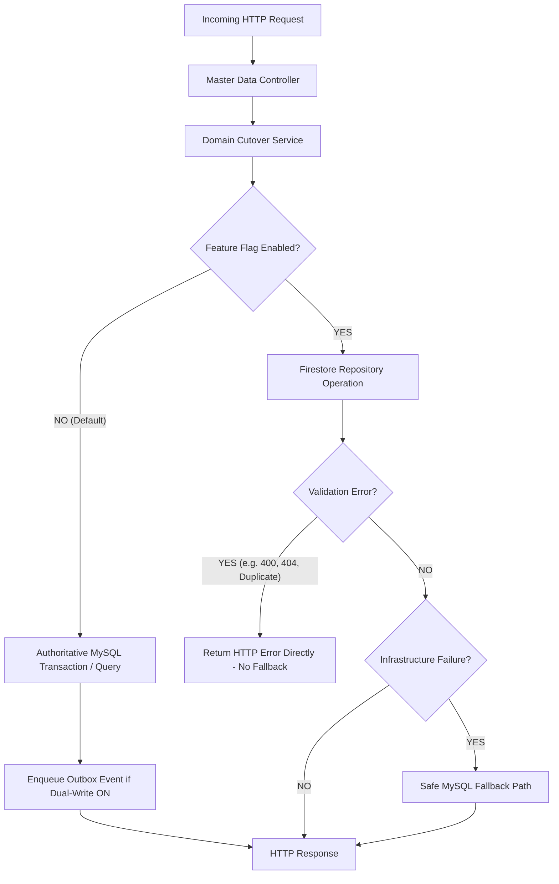

# HPMS Phase 3 Step 7 — Master Data Controllers Firestore Migration Implementation Report

**Date:** August 20, 2026  
**Status:** IMPLEMENTATION COMPLETE — FLAGS OFF — AWAITING CONTROLLED CUTOVER REVIEW  
**Scope:** Room Types, Staff, Inventory (Categories, Products, Stock), Housekeeping (Rooms, Assignments, Status)

---

## 1. Executive Summary

Phase 3 Step 7 implements dual-path Firestore cutover architecture for all remaining **Master Data Controllers** in the HPMS backend while preserving 100% backward compatibility, MySQL fallback, transactional safety, and zero-breaking-change API contracts.

### Scope Summary
1. **Room Types Master Data (`roomTypeController.js`, `RoomTypeCutoverService`, `roomTypesRepository.js`)**:
   - CRUD routing for room types with automatic code/ID reconciliation.
   - Dual-write event generation maintained on MySQL paths.
2. **Staff Management Master Data (`staffController.js`, `StaffCutoverService`, `staffRepository.js`)**:
   - Soft-delete semantics, password hash filtering on output, and non-blocking Firebase Custom Claims sync integration.
3. **Inventory Management Master Data (`inventoryController.js`, `InventoryCutoverService`, `inventoryCategoriesRepository.js`, `inventoryProductsRepository.js`)**:
   - Inventory categories CRUD with cascade deletion prevention when products are attached.
   - Products master CRUD with stock metrics calculation (`totalProducts`, `activeProducts`, `lowStockProducts`, `outOfStockProducts`).
   - Atomic concurrency protection on stock mutations rejecting negative quantities.
4. **Housekeeping Master Data (`housekeepingController.js`, `HousekeepingCutoverService`, `housekeepingRepository.js`, `roomsRepository.js`)**:
   - Housekeeping room listing, task assignments, and housekeeping status transitions (`Clean`, `Dirty`, `Inspected`, `Vacant Ready`).
   - Strict preservation of room occupancy status (`rooms.status`) while updating housekeeping attributes.

---

## 2. Feature Flags & Safe Defaults

All four feature flags have been created, added to `backend/config/featureFlags.js`, exported in `FEATURE_FLAGS`, and defaulted to **`false`** in `backend/.env`:

| Feature Flag | Helper Function | Default Runtime State | Authoritative Source |
| :--- | :--- | :--- | :--- |
| `USE_FIRESTORE_ROOM_TYPES` | `isFirestoreRoomTypesEnabled()` | `false` | MySQL `room_types` |
| `USE_FIRESTORE_STAFF` | `isFirestoreStaffEnabled()` | `false` | MySQL `staff` |
| `USE_FIRESTORE_INVENTORY` | `isFirestoreInventoryEnabled()` | `false` | MySQL `inventory_categories` / `inventory_products` |
| `USE_FIRESTORE_HOUSEKEEPING` | `isFirestoreHousekeepingEnabled()` | `false` | MySQL `rooms` / `housekeeping_logs` |

---

## 3. Architecture & Fallback Mechanics

### Safety & Invariant Guarantees
- **No MySQL Schema Mutations:** Zero `ALTER TABLE`, zero column changes, zero schema migrations.
- **No Table Deletions:** All MySQL tables (`room_types`, `staff`, `inventory_categories`, `inventory_products`, `rooms`, `housekeeping_logs`) remain intact.
- **Transactional Outbox Intact:** Outbox worker continues processing dual-write events smoothly.
- **Idempotency & Concurrency:** Concurrency controls protect Firestore document transactions and fallback operations.
- **Instant Rollback:** Setting any flag to `false` instantly reverts authority to MySQL without restart or deployment dependencies.

---

## 4. Verification & Test Execution Results

All automated test suites executed cleanly:

| Test Suite | Purpose | Tests | Status |
| :--- | :--- | :---: | :---: |
| `testPhase3Step7MasterDataFirestoreMigration.mjs` | Step 7 Master Data Dual-Path & Fallback Harness | **38 / 38** | **PASSED** |
| `testPhase3Step5FirebaseOnlyBusinessDate.mjs` | Step 5 Firebase-Only Business Date & Day End | **37 / 37** | **PASSED** |
| `testPhase3Step4FirebaseOnlyRbac.mjs` | Step 4 Firebase-Only RBAC & Permissions | **73 / 73** | **PASSED** |
| `testPhase3Step3D4GuestBookingOwnership.mjs` | Step 3D-4 Guest Resolution Verification | **65 / 65** | **PASSED** |
| `npm run build` | Frontend Vite Bundle Compilation | **Pass** | **PASSED** |

---

## 5. Current File Index

- [`backend/config/featureFlags.js`](file:///d:/projects/hotel/backend/config/featureFlags.js)
- [`backend/services/roomTypeCutoverService.js`](file:///d:/projects/hotel/backend/services/roomTypeCutoverService.js)
- [`backend/services/staffCutoverService.js`](file:///d:/projects/hotel/backend/services/staffCutoverService.js)
- [`backend/services/inventoryCutoverService.js`](file:///d:/projects/hotel/backend/services/inventoryCutoverService.js)
- [`backend/services/housekeepingCutoverService.js`](file:///d:/projects/hotel/backend/services/housekeepingCutoverService.js)
- [`backend/controllers/roomTypeController.js`](file:///d:/projects/hotel/backend/controllers/roomTypeController.js)
- [`backend/controllers/staffController.js`](file:///d:/projects/hotel/backend/controllers/staffController.js)
- [`backend/controllers/inventoryController.js`](file:///d:/projects/hotel/backend/controllers/inventoryController.js)
- [`backend/controllers/housekeepingController.js`](file:///d:/projects/hotel/backend/controllers/housekeepingController.js)
- [`backend/repositories/firestore/roomTypesRepository.js`](file:///d:/projects/hotel/backend/repositories/firestore/roomTypesRepository.js)
- [`backend/repositories/firestore/staffRepository.js`](file:///d:/projects/hotel/backend/repositories/firestore/staffRepository.js)
- [`backend/repositories/firestore/inventoryCategoriesRepository.js`](file:///d:/projects/hotel/backend/repositories/firestore/inventoryCategoriesRepository.js)
- [`backend/repositories/firestore/inventoryProductsRepository.js`](file:///d:/projects/hotel/backend/repositories/firestore/inventoryProductsRepository.js)
- [`backend/repositories/firestore/housekeepingRepository.js`](file:///d:/projects/hotel/backend/repositories/firestore/housekeepingRepository.js)
- [`backend/tests/testPhase3Step7MasterDataFirestoreMigration.mjs`](file:///d:/projects/hotel/backend/tests/testPhase3Step7MasterDataFirestoreMigration.mjs)
- [`backend/.env`](file:///d:/projects/hotel/backend/.env)
