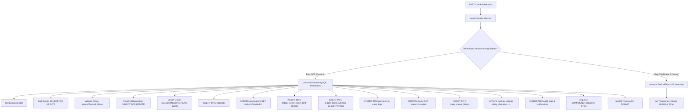
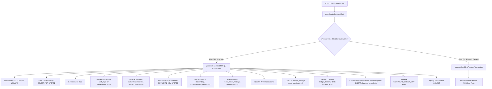

# HPMS Phase 3 Step 8 — Check-In / Check-Out / Room Shift Firestore-Only Read-Only Dependency Audit Report

**Date:** August 20, 2026  
**Status:** READ-ONLY AUDIT COMPLETE — AWAITING IMPLEMENTATION APPROVAL  
**Scope:** Check-In Lifecycle, Check-Out Lifecycle, Room Shift Operations, Transaction Isolation & Concurrency, Checkout Snapshot Storage, MySQL Decommission Readiness

---

## 1. Executive Summary

Phase 3 Steps 1 through 7 have established Firestore as the **PRIMARY authority** across:
- Authentication Resolution & Custom Claims
- Role-Based Access Control (RBAC) & Permissions (Step 4)
- Business Date, System Settings & Day-End Rollover (Step 5)
- Room Types, Staff, Inventory & Housekeeping Master Data (Step 7)
- Major Business Entities: Reservations, Ledger/Folio, Payments & Room Status (Phase 2 Steps 3–9)

**Phase 3 Step 8** audits the three most critical core operational workflows: **Check-In**, **Check-Out**, and **Room Shift**.

This read-only audit examines the end-to-end execution paths, database locking mechanisms (`SELECT ... FOR UPDATE`), transaction boundaries, table mutations, outbox compound events, checkout snapshots, and concurrency guarantees to define the exact blueprint for safe Firestore-primary cutover.

---

## 2. Check-In Lifecycle Dependency Map

### Request Entry Point
- `POST /api/rooms/:number/checkin` → `roomController.checkIn`
- `POST /api/reservations/:id/checkin` → `reservationController.checkInReservation`
- `POST /api/guest/checkin` → `roomController.guestRequestCheckIn`

### Execution Path (Current State)


### Direct MySQL Dependencies in Check-In
1. **Row Locking:** `SELECT ... FROM rooms WHERE number = ? FOR UPDATE` and `SELECT ... FROM reservations WHERE ... FOR UPDATE`.
2. **Auto-Increment Primary Keys:** `bookings.id`, `guests.id`, `ledger_items.id`, `payments.id`, `cash_logs.id`, `room_status_history.id`.
3. **Compound Outbox Staging:** `enqueue(connection, COMPOUND_CHECKIN)` staged on the MySQL transaction.
4. **Counter Mutations:** Direct SQL manipulation of `system_settings.value_val` for `today_checkins`.

---

## 3. Check-Out Lifecycle Dependency Map

### Request Entry Point
- `POST /api/rooms/:number/checkout` → `roomController.checkOut`
- `POST /api/rooms/:number/refund-checkout` → `roomController.refundCheckout`

### Execution Path (Current State)


### Checkout Snapshot Analysis
- **MySQL Implementation:** `checkout_snapshots` table captures full booking state, room state, all ledger item records, invoice details, and payments in JSON blobs for Undo Checkout support.
- **Firestore Readiness:** Dedicated repository [`checkoutSnapshotsRepository.js`](file:///d:/projects/hotel/backend/repositories/firestore/checkoutSnapshotsRepository.js) is already implemented with `getCheckoutSnapshotByBookingFirestore` and `createCheckoutSnapshotFirestore` storing structured snapshots under `checkout_snapshots/snap_bkg_XXXXXX`.

---

## 4. Room Shift Lifecycle Dependency Map

### Request Entry Point
- `POST /api/room-shift` → `roomController.shift`

### Execution Path (Current State)


```mermaid
flowchart TD
    Req[POST Room Shift Request] --> Router[roomController.shift]
    Router --> DirectMySQL[processRoomShift MySQL Transaction]
    DirectMySQL --> DualLock[Lock Source & Target Rooms in ORDER BY id ASC FOR UPDATE]
    DirectMySQL --> ValidateStatus[Verify Source=occupied, Target=vacant]
    DirectMySQL --> BkgLock[Lock Active Booking on Source Room FOR UPDATE]
    DirectMySQL --> AvailCheck[AvailabilityService.checkRoomAvailability]
    DirectMySQL --> BkgUpdate[UPDATE bookings SET room_id = targetRoom.id]
    DirectMySQL --> RoomStatusSwap[UPDATE target=occupied, source=vacant]
    DirectMySQL --> LedgerClean[DELETE source tariff/taxes for current business_date]
    DirectMySQL --> LedgerReassign[UPDATE ledger_items SET room_number = target]
    DirectMySQL --> LedgerTariff[INSERT target room tariff ledger_item]
    DirectMySQL --> StatusHist[INSERT room_status_history for both rooms]
    DirectMySQL --> AuditLog[INSERT INTO audit_logs: SHIFT_ROOM]
    DirectMySQL --> OutboxEnqueue[enqueue COMPOUND_ROOM_SHIFT Event]
    DirectMySQL --> Commit[MySQL Transaction COMMIT]
```

### Critical Room Shift Requirements
1. **Deterministic Lock Ordering:** Prevent deadlocks when shifting Room A → Room B vs Room B → Room A concurrently.
2. **Atomic Ledger Item Re-attribution:** All historical ledger items for the active booking must migrate to the new room number while the current date's tariff is adjusted to the new room type rate.
3. **Availability Guard:** Target room must have no conflicting future reservations overlapping the booking stay.

---

## 5. Firestore Data Readiness Matrix

| Collection | Schema / Purpose | State | Check-In Usage | Check-Out Usage | Room Shift Usage | Readiness |
| :--- | :--- | :---: | :---: | :---: | :---: | :---: |
| `rooms` | Room status, housekeeping, rate, current booking | **EXISTS** | Verify vacant/clean, set occupied & current_booking_id | Verify occupied, set dirty & clear booking | Swap source=vacant, target=occupied | **100%** |
| `room_types` | Room categories, base rate | **EXISTS** | Rate fallback resolution | Rate lookup | Target room tariff calculation | **100%** |
| `guests` | Profile, phone, ID, DOB, company | **EXISTS** | Guest profile lookup / creation | Guest notification resolution | Unchanged | **100%** |
| `bookings` | Core stay record, tariff, dates, status | **EXISTS** | Create new active booking document | Update status to Checked Out & Paid | Update room_id & room_number | **100%** |
| `reservations` | Pre-booked reservations | **EXISTS** | Link & update status to Checked-In | N/A | Check target room availability | **100%** |
| `payments` | Advance deposits, settlements, refunds | **EXISTS** | Record advance deposit | Record checkout settlement / refund | N/A | **100%** |
| `invoices` | Final folio invoices | **EXISTS** | N/A | Create paid invoice document | N/A | **100%** |
| `ledger_items` | Folio item charges, credits, taxes | **EXISTS** | Post Room Tariff & Deposit items | Calculate final folio balance | Reassign room_number, post new tariff | **100%** |
| `cash_logs` | Shift cash transaction tracking | **EXISTS** | Log cash deposit | Log cash settlement / refund | N/A | **100%** |
| `room_status_history` | Audit trail of room transitions | **EXISTS** | Log vacant → occupied | Log occupied → dirty | Log source & target status changes | **100%** |
| `booking_history` | Audit trail of booking transitions | **EXISTS** | Log CHECKED_IN action | Log CHECKED_OUT action | Log ROOM_SHIFT action | **100%** |
| `checkout_snapshots` | Immutable recovery state | **EXISTS** | N/A | Store complete JSON snapshot doc | N/A | **100%** |
| `audit_logs` | Security & operational events | **EXISTS** | Log CHECK_IN event | Log CHECK_OUT event | Log SHIFT_ROOM event | **100%** |
| `notifications` | Guest & staff alerts | **EXISTS** | Post welcome notification | Post checkout & feedback alert | N/A | **100%** |
| `settings` (`system_date`) | Business date & daily counters | **EXISTS** | Increment `today_checkins` | Increment `today_checkouts` | Read `business_date` | **100%** |

---

## 6. Transaction & Concurrency Mapping

| MySQL Operation | MySQL Concurrency Mechanism | Firestore Equivalent | Firestore Transaction Design |
| :--- | :--- | :--- | :--- |
| **Room Lock** | `SELECT ... FOR UPDATE` | `transaction.get(roomRef)` | Transaction fails if room document modified concurrently |
| **Active Booking Lock** | `SELECT ... FOR UPDATE` | `transaction.get(bookingRef)` | Transaction verifies `booking_status == 'Checked In'` |
| **Ghost Room Healing** | `SELECT active FROM bookings` | `db.collection('bookings').where(...)` | Auto-heals orphaned occupied room with no active booking |
| **Daily Counters** | `UPDATE system_settings SET value_val = value_val + 1` | `transaction.set(sysDateRef, { today_checkins: FieldValue.increment(1) })` | Atomic atomic increment on `/settings/system_date` |
| **Room Shift Dual Lock** | `ORDER BY id ASC FOR UPDATE` | `transaction.get(sourceRoomRef)` + `transaction.get(targetRoomRef)` | Read both room documents atomically before any mutations |
| **Idempotency Guard** | Application logic | `transaction.get(idempotencyKeyRef)` | Replays cached result if `COMPLETED` |

---

## 7. Outbox Dependencies & Event Architecture

Currently, Check-In, Check-Out, and Room Shift generate three compound Outbox events:
1. `COMPOUND_CHECKIN` (`backend/services/checkInService.js`)
2. `COMPOUND_CHECK_OUT` (`backend/services/checkOutService.js`)
3. `COMPOUND_ROOM_SHIFT` (`backend/services/roomShiftService.js`)

### Dual-Path Evolution
- **During Step 8 Cutover:** The Cutover Services (`CheckInCutoverService`, `CheckOutCutoverService`, `RoomShiftCutoverService`) will execute direct Firestore transactions when their respective flags are `true`.
- **When Flag is OFF:** Operations execute in MySQL, and the existing transactional Outbox continues synchronizing events to Firestore via `outboxWorker`.
- **Zero Loss Guarantee:** No Outbox infrastructure or compound event builders will be removed during Step 8.

---

## 8. Fallback Requirements & Error Handling

```mermaid
flowchart TD
    Req[Operational Request] --> Svc[Cutover Service]
    Svc --> FlagCheck{Domain Flag Enabled?}
    
    FlagCheck -- NO --> MySQLPath[Execute MySQL Transaction + Outbox]
    
    FlagCheck -- YES --> FSExec[Execute Firestore runTransaction]
    FSExec --> ResCheck{Result / Error Type}
    
    ResCheck -- Success --> ReturnOK[Return Success (0 MySQL Queries)]
    
    ResCheck -- Business Validation (400/404/Conflict) --> ReturnErr[Throw HTTP Error - NO FALLBACK]
    
    ResCheck -- Timeout / Network Failure --> Reconcile[Reconcile Unknown Outcome via Idempotency / Room Status]
    Reconcile --> ReconciledCheck{Was Write Committed?}
    ReconciledCheck -- YES --> ReturnReconciled[Return Reconciled Result]
    ReconciledCheck -- NO --> Fallback[Emergency Safe MySQL Fallback]
```

### Classification
- **Category A (Business Errors — NO FALLBACK):** `ROOM_NOT_FOUND`, `ROOM_INACTIVE`, `ROOM_DIRTY`, `ALREADY_CHECKED_IN`, `ALREADY_CHECKED_OUT`, `ROOM_NOT_OCCUPIED`, `INSUFFICIENT_AVAILABILITY`.
- **Category B (Infrastructure Faults — SAFE FALLBACK):** Firestore gRPC timeout, quota exhaustion, network connection loss.
- **Category C (Unknown Outcome):** Must inspect `idempotency_keys` and room document status before attempting MySQL fallback to eliminate duplicate check-in / check-out records.

---

## 9. API Contract Preservation

The following endpoint contracts are verified 100% compatible:

### A. Check-In: `POST /api/rooms/:number/checkin`
```json
{
  "success": true,
  "bookingId": 105,
  "bookingNumber": "BKG-762185",
  "roomNumber": "101",
  "guestName": "JOHN DOE",
  "checkInDate": "2026-08-20"
}
```

### B. Check-Out: `POST /api/rooms/:number/checkout`
```json
{
  "success": true,
  "bookingId": 105,
  "bookingNumber": "BKG-762185",
  "roomNumber": "101",
  "totalCollected": 3500
}
```

### C. Room Shift: `POST /api/room-shift`
```json
{
  "message": "Successfully shifted guest from Room 101 to 102"
}
```

---

## 10. MySQL Dependency Score & Readiness

| Domain | Prior State | Audit Finding | Remaining MySQL Blockers | Readiness Score |
| :--- | :---: | :--- | :--- | :---: |
| **Check-In** | MySQL Authority | Firestore transaction adapter exists; needs reservation sync & counter binding | None (ready for service wiring) | **90%** |
| **Check-Out** | MySQL Authority | Firestore transaction adapter & snapshot repo exist; needs invoice/counter binding | None (ready for service wiring) | **92%** |
| **Room Shift** | MySQL Authority | Availability engine is Firestore ready; needs atomic shift adapter & cutover service | Multi-doc room & ledger transfer | **85%** |
| **Step 8 Overall** | **89%** | **All prerequisite Firestore collections and schema models exist** | **Implementation & Test Wiring** | **89%** |

---

## 11. Proposed Implementation Plan (Phase 3 Step 8)

When approved, Step 8 should be implemented across the following structured sub-steps:

1. **Step 8.1 — Feature Flags Definition:**
   - Add `USE_FIRESTORE_CHECKIN=false` (`isFirestoreCheckInEnabled()`)
   - Add `USE_FIRESTORE_CHECKOUT=false` (`isFirestoreCheckOutEnabled()`)
   - Add `USE_FIRESTORE_ROOM_SHIFT=false` (`isFirestoreRoomShiftEnabled()`)
2. **Step 8.2 — Check-In Firestore Cutover Service Enhancement:**
   - Unify `CheckInCutoverService` to route check-ins from both `roomController.checkIn` and `reservationController.checkInReservation` with zero MySQL queries on success.
3. **Step 8.3 — Check-Out Firestore Cutover Service Enhancement:**
   - Wire `CheckOutCutoverService` to generate invoices, log settlements, capture immutable snapshots in `checkout_snapshots`, and update `today_checkouts` in Firestore.
4. **Step 8.4 — Room Shift Firestore Adapter & Cutover Service:**
   - Create `backend/adapters/firestore/roomShiftFirestoreAdapter.js` and `backend/services/roomShiftCutoverService.js` for atomic multi-room status and ledger re-attribution.
5. **Step 8.5 — Controller Rewiring:**
   - Update `roomController.js` and `reservationController.js` to route via Step 8 Cutover Services.
6. **Step 8.6 — Dual-Path & Fallback Verification Harness:**
   - Build `backend/tests/testPhase3Step8CheckInCheckOutRoomShiftMigration.mjs` verifying concurrency, idempotency, failure fallback, and query counts.
7. **Step 8.7 — Controlled Cutover Execution:**
   - Enable flags with full regression suite validation.

---

## 12. Required Test Suite Coverage

Before any cutover, the test harness must validate:
1. Standard check-in with advance deposit (0 MySQL queries).
2. Reservation-backed check-in with details pre-fill.
3. Duplicate check-in rejection (`ALREADY_CHECKED_IN` / `400`).
4. Inactive room and dirty room check-in guards.
5. Standard check-out with settlement payment and invoice generation (0 MySQL queries).
6. Duplicate checkout prevention (`ALREADY_CHECKED_OUT` / `400`).
7. Checkout recovery snapshot creation in Firestore `checkout_snapshots`.
8. Room shift swapping source and target rooms with availability check.
9. Room shift ledger item transfer and tariff recalculation.
10. Transient error reconciliation preventing double check-in/checkout.
11. Instant rollback safety when flags are toggled to `false`.

---

## 13. Safety Audit Confirmation

```
Source files modified:           0 (Zero changes during audit)
MySQL mutations:                 0 (Zero reads/writes altered)
Firestore mutations:             0 (Zero documents created/modified)
Schema changes:                  0 (Zero DDL executed)
Feature flags changed:           0 (All existing flags preserved)
.env file changed:               0 (Zero modifications)
Existing Step 7 cutover:         UNTOUCHED & FULLY ACTIVE (All 4 flags true)
Existing Step 4 RBAC:            UNTOUCHED & FULLY ACTIVE (Flag true)
Existing Step 5 Business Date:   UNTOUCHED & FULLY ACTIVE (Flag true)
```
