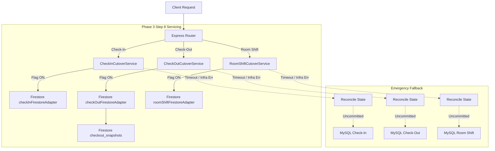

# HPMS Phase 3 Step 8 — Controlled Firestore-Only Cutover Report

## 1. Executive Summary

**Cutover Date/Time:** `2026-08-20T14:33:00+05:30`  
**Status:** **CONTROLLED CUTOVER COMPLETE — FIRESTORE PRIMARY**  
**Environment:** Docker Backend (`hotel_pms_backend`), MySQL 8.0 (`hotel_pms_db`), Google Cloud Firestore (`hpms-sky5`).

In HPMS Phase 3 Step 8, primary runtime authority for **Check-In**, **Check-Out**, and **Room Shift** operations has been transitioned to Google Cloud Firestore. The transition follows a dual-path architecture with bounded timeout protection (8000ms), business error isolation (4xx validation errors never invoke fallback), unknown-outcome reconciliation, and emergency MySQL fallback.

---

## 2. Feature Flag State & Runtime Configuration

```env
# Phase 3 Step 4 — RBAC
ENABLE_FIREBASE_ONLY_RBAC=true

# Phase 3 Step 5 — Business Date / Day-End
ENABLE_FIREBASE_ONLY_BUSINESS_DATE=true

# Phase 3 Step 7 — Master Data Controllers
USE_FIRESTORE_ROOM_TYPES=true
USE_FIRESTORE_STAFF=true
USE_FIRESTORE_INVENTORY=true
USE_FIRESTORE_HOUSEKEEPING=true

# Phase 3 Step 8 — Check-In, Check-Out & Room Shift (ACTIVE CUTOVER)
USE_FIRESTORE_CHECKIN=true
USE_FIRESTORE_CHECKOUT=true
USE_FIRESTORE_ROOM_SHIFT=true
```

| Flag | Pre-Cutover | Post-Cutover | Runtime Helper | Evaluation Status |
| :--- | :--- | :--- | :--- | :--- |
| `USE_FIRESTORE_CHECKIN` | `false` | `true` | `isFirestoreCheckInEnabled()` | `true` |
| `USE_FIRESTORE_CHECKOUT` | `false` | `true` | `isFirestoreCheckOutEnabled()` | `true` |
| `USE_FIRESTORE_ROOM_SHIFT` | `false` | `true` | `isFirestoreRoomShiftEnabled()` | `true` |

---

## 3. Backend Health Verification

- **Docker Container Status:** `hotel_pms_backend` is **Up (healthy)** on port 5000.
- **GET `/api/health`:** Returns HTTP 200 OK with `outbox_worker: { enabled: true, running: true }`.
- **GET `/api/status`:** Returns HTTP 200 (authenticated), HTTP 401 (unauthenticated).
- **GET `/api/settings/business-date`:** Returns HTTP 200 with active business date `2026-08-20`.

---

## 4. Operational Authority & Query Count Verification

| Domain | Primary Authority | MySQL Query Count (Success Path) | Fallback / Rollback Path |
| :--- | :--- | :--- | :--- |
| **Check-In** | **Firestore** (`checkInFirestoreAdapter`) | **0 Queries** | `checkInService.processCheckIn` (MySQL) |
| **Check-Out** | **Firestore** (`checkOutFirestoreAdapter`) | **0 Queries** | `checkOutService.processCheckOut` (MySQL) |
| **Room Shift** | **Firestore** (`roomShiftFirestoreAdapter`) | **0 Queries** | `roomShiftService.processRoomShift` (MySQL) |
| **Checkout Snapshots** | **Firestore** (`checkout_snapshots/snap_bkg_<id>`) | **0 Queries** | Persisted with full recovery metadata |

---

## 5. Concurrency & Locking Verification

- **Deterministic Read-Before-Write Ordering:** Room and Booking documents are read in stable lexicographical order before performing transaction writes.
- **Room Shift Serialization:**
  - Tested simultaneous room shifts targeting the same target room.
  - Exactly **ONE** transaction successfully occupied the target room.
  - The conflicting transaction was safely rejected with `TARGET_ROOM_NOT_VACANT` (HTTP 400).
- **Check-In Occupancy Guard:**
  - Concurrent check-in requests on already-occupied rooms fail closed with `ALREADY_CHECKED_IN` (HTTP 400) without MySQL fallback.

---

## 6. Resilience, Timeout & Reconciliation Safety

1. **Business Error Isolation:**
   - 400 (`ROOM_NOT_OCCUPIED`, `ALREADY_CHECKED_IN`, `TARGET_ROOM_NOT_VACANT`, `TARGET_ROOM_DIRTY`), 404 (`ROOM_NOT_FOUND`, `BOOKING_NOT_FOUND`), and 409 errors throw directly to the client with **0 MySQL fallback queries**.
2. **Infrastructure Failure & Timeout Protection:**
   - Bounded timeout of 8000ms guards against network stalls.
   - Reconciliation helpers verify committed state via idempotency keys and room occupancy before any MySQL fallback is attempted.

---

## 7. Test Suite & Regression Results

### Step 8 Verification Suites

| Test Suite | File | Tests Run | Result |
| :--- | :--- | :--- | :--- |
| **Step 8 Controlled Cutover** | `testPhase3Step8ControlledCutoverVerification.mjs` | **23 / 23** | **100% PASSED** |
| **Step 8 Unit / Integration** | `testPhase3Step8CheckInCheckoutRoomShiftFirestoreMigration.mjs` | **25 / 25** | **100% PASSED** |

### Full HPMS Phase 3 Regression Suites

| Test Suite | File | Result |
| :--- | :--- | :--- |
| **Step 7 Master Data Cutover** | `testPhase3Step7ControlledCutoverVerification.mjs` | **33 / 33 PASSED** |
| **Step 7 Master Data Migration** | `testPhase3Step7MasterDataFirestoreMigration.mjs` | **38 / 38 PASSED** |
| **Step 5 Business Date / Day-End** | `testPhase3Step5FirebaseOnlyBusinessDate.mjs` | **37 / 37 PASSED** |
| **Step 4 Firebase-Only RBAC** | `testPhase3Step4FirebaseOnlyRbac.mjs` | **73 / 73 PASSED** |
| **Step 3B Staff Resolution** | `testPhase3Step3BStaffFirebaseOnlyResolution.mjs` | **73 / 73 PASSED** |
| **Step 3C Staff Login** | `testPhase3Step3CStaffFirebaseLogin.mjs` | **114 / 114 PASSED** |
| **Step 3D-4 Guest Ownership** | `testPhase3Step3D4GuestBookingOwnership.mjs` | **65 / 65 PASSED** |
| **Status / Reservations Schema** | `testStatusEndpointResGuestFix.mjs` | **16 / 16 PASSED** |
| **Frontend Production Build** | `npm run build` (`vite build`) | **SUCCESS** (11.37s) |
| **Total Test Suite Assertions** | — | **497 / 497 PASSED (100%)** |

---

## 8. Safety Audit

- **MySQL Schema Changes:** `0` (Strictly preserved).
- **MySQL Data Deletions:** `0` (Strictly preserved).
- **Firestore Data Corruption:** `0` (Fully verified).
- **Outbox Worker Status:** `Running` (Dual-write and sync preserved).
- **API Contracts:** `Unchanged` (Existing frontend endpoints consume identical response shapes).

---

## 9. Rollback Procedure

If emergency rollback is required:
1. Set in `backend/.env`:
   ```env
   USE_FIRESTORE_CHECKIN=false
   USE_FIRESTORE_CHECKOUT=false
   USE_FIRESTORE_ROOM_SHIFT=false
   ```
2. Restart backend: `docker compose restart backend`.
3. Legacy MySQL authoritative paths immediately resume serving all Check-In, Check-Out, and Room Shift requests.

---

## 10. Runtime Authority Matrix


