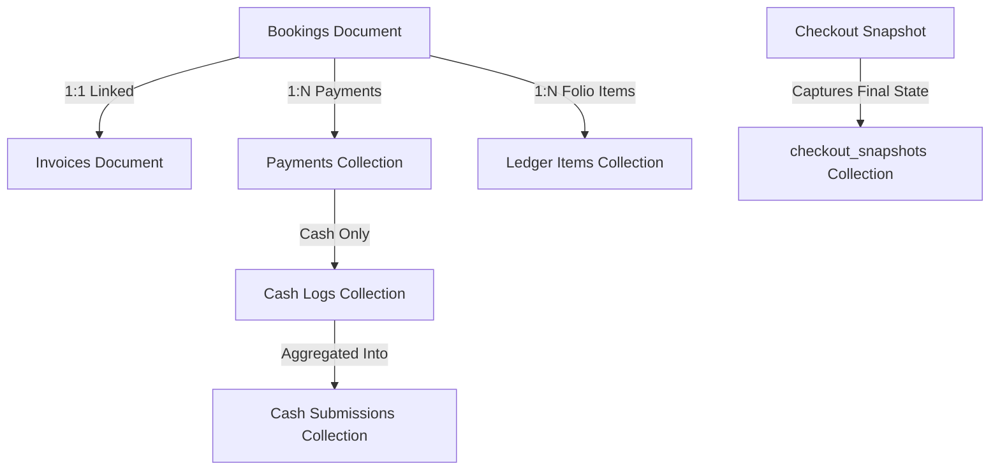

# HPMS Phase 3 Step 9 — Financials, Invoices & Folio Settlements Firestore-Only Dependency Audit

## 1. Executive Summary

**Audit Date:** 2026-08-20  
**Phase:** HPMS Phase 3 Step 9 (Read-Only Architectural & Dependency Audit)  
**Objective:** Audit all remaining MySQL dependencies in the Financial, Invoicing, Folio/Ledger, Cash Drawer, and Settlement domains to prepare for Phase 3 Step 9 dual-path implementation and eventual decommission.

### Current Overall Readiness
- **Payments Domain:** `85%` (Read paths & basic cash cutover completed in Phase 2 Step 7; Razorpay transactions and deep settlement coordination require migration).
- **Ledger / Folio Domain:** `70%` (Read paths served from Firestore; `addLedgerItem`, night audit rollover postings, and undo day end ledger deletions require atomic transaction migration).
- **Cash / Drawer Domain:** `85%` (`submitCash` and `getCashSubmissions` have Firestore adapters; running drawer calculations and daily reconciliation require Firestore-only aggregations).
- **Invoices Domain:** `40%` (`getOrGenerateInvoiceNumber` is currently 100% MySQL primary; requires `InvoiceCutoverService` and atomic Firestore adapter).
- **Refunds & Adjustments:** `35%` (`processRefundCheckout` in `roomController.js` is 100% MySQL primary with Outbox dual-write; requires `RefundCutoverService` and atomic multi-entity transaction).
- **Financial Reporting Compatibility:** `100%` (Phase 2 Step 9 verified reports consuming Firestore collections directly).
- **Overall Phase 3 Step 9 Financial Decommission Readiness:** `69%`.

---

## 2. Current Authority Matrix

| Financial Operation | Endpoint / Function | Current Primary Authority | Dual-Write / Outbox | Fallback Path | Phase 3 Step 9 Migration Target |
| :--- | :--- | :--- | :--- | :--- | :--- |
| **Finalize Payment** | `POST /api/payments/finalize` | **Firestore Primary** (`PaymentCutoverService`) | `COMPOUND_PAYMENT_FINALIZED` | MySQL (`payments`, `invoices`) | Pure Firestore Primary (flagged `USE_FIRESTORE_FINANCIALS`) |
| **Get Payments by Booking** | `GET /api/payments/booking/:id` | **Firestore Primary** (`PaymentCutoverService`) | None (Read) | MySQL `payments` + `invoices` | Pure Firestore Primary |
| **Get My Payments (Guest)** | `GET /api/payments/guest/my` | **Firestore Primary** (`PaymentCutoverService`) | None (Read) | MySQL `payments` JOIN `bookings` | Pure Firestore Primary |
| **Confirm Cash Payment** | `PUT /api/payments/booking/:id/confirm-cash` | **Firestore Primary** (`PaymentCutoverService`) | `COMPOUND_CASH_PAYMENT_CONFIRMED` | MySQL `payments`, `invoices`, `notifications` | Pure Firestore Primary |
| **Guest Payment Status** | `GET /api/payments/guest/payment-status` | **Firestore Primary** (`PaymentCutoverService`) | None (Read) | MySQL `payments` JOIN `bookings` | Pure Firestore Primary |
| **Generate/Get Invoice Number** | `POST /api/invoices/generate/:bookingId` | **MySQL Primary** (`invoiceController.js`) | `INVOICE_CREATED` | None (Direct MySQL) | New `InvoiceCutoverService` + Firestore `/invoices` |
| **Submit Cash** | `POST /api/cash/submit` | **Firestore Primary** (`CashCutoverService`) | `COMPOUND_CASH_SUBMITTED` | MySQL `cash_submissions`, `audit_logs` | Pure Firestore Primary |
| **Get Cash Submissions** | `GET /api/cash/submissions` | **Firestore Primary** (`CashCutoverService`) | None (Read) | MySQL `cash_submissions` | Pure Firestore Primary |
| **Post Manual Ledger Charge** | `POST /api/rooms/:number/ledger` (`addLedgerItem`) | **MySQL Primary** (`roomController.js`) | None | None (Direct MySQL) | New `LedgerCutoverService.addLedgerItem` |
| **Get Room Ledger (Folio)** | `GET /api/rooms/:number/ledger` (`getLedger`) | **Firestore Primary** (`LedgerCutoverService`) | None (Read) | MySQL `ledger_items` | Pure Firestore Primary |
| **Refund Checkout** | `POST /api/rooms/:number/refund-checkout` | **MySQL Primary** (`roomController.js`) | `COMPOUND_REFUND_CHECKOUT` | None (Direct MySQL) | New `RefundCutoverService` + Firestore transaction |
| **Razorpay Order Creation** | `POST /api/payments/razorpay/order` | **MySQL Primary** (`razorpayController.js`) | None | None (Direct MySQL) | New `razorpay_transactions` in Firestore |
| **Razorpay Payment Verification** | `POST /api/payments/razorpay/verify` | **MySQL Primary** (`razorpayController.js`) | None | None (Direct MySQL) | Firestore atomic signature verification |

---

## 3. Payment Domain Deep Audit

### Detailed Flow & Query Map
1. **`finalizePayment`** (`paymentController.js`):
   - MySQL Queries:
     - `SELECT id, amount, payment_method... FROM payments WHERE booking_id = ? AND payment_status = 'Pending'`
     - `UPDATE payments SET payment_method = ?, payment_status = 'Pending', transaction_id = ? WHERE id = ?`
     - `UPDATE invoices SET status = CASE ... WHERE booking_id = ?`
   - Classification: `FIRESTORE PRIMARY` (via `PaymentCutoverService.finalizePayment`, with MySQL fallback).
2. **`confirmCashPayment`** (`paymentController.js`):
   - MySQL Queries:
     - `SELECT id, amount, business_date FROM payments WHERE booking_id = ? AND payment_method = 'Cash' AND payment_status = 'Pending' FOR UPDATE`
     - `UPDATE payments SET payment_status = 'Paid', payment_date = NOW(), received_by = ? WHERE id = ?`
     - `UPDATE invoices i INNER JOIN (SELECT booking_id, SUM(...) as actual_paid FROM payments ...) p SET i.paid_amount = p.actual_paid, i.balance_due = ...`
     - `INSERT INTO notifications (user_id, title, message)`
   - Classification: `FIRESTORE PRIMARY` (via `PaymentCutoverService.confirmCashPayment`, with MySQL fallback).
3. **`getPaymentsByBooking`** & **`getMyPayments`**:
   - Classification: `FIRESTORE PRIMARY` (bypasses MySQL reads).

---

## 4. Ledger & Folio Write Audit

### Current Limitations & MySQL Dependencies
1. **Manual Charge Posting (`addLedgerItem` in `roomController.js`)**:
   - Currently executes direct MySQL queries:
     - `SELECT r.id, r.status FROM rooms r WHERE r.number = ?`
     - `SELECT id FROM bookings WHERE room_id = ? AND booking_status = 'Checked In'`
     - `SELECT value_val FROM system_settings WHERE key_name = 'system_date'`
     - `SELECT id FROM ledger_items WHERE booking_id = ? AND desc = ? AND amount = ? AND created_at >= NOW() - INTERVAL 5 SECOND` (5-second deduplication)
     - `INSERT INTO ledger_items (room_number, desc, qty, amount, business_date, booking_id) VALUES (...)`
   - **Gap:** Bypasses Firestore dual-write outbox entirely.
   - **Migration Requirement:** Must be wrapped in `LedgerCutoverService.addLedgerItem` and post to Firestore `/ledger_items/ledger_<bookingId>_<itemId>`.

2. **Night Audit Rollover & Tax Posting**:
   - `BusinessDateService.processNightAudit`:
     - Inserts daily room tariff charges and GST debits into `ledger_items`.
     - In Step 5, night audit is Firestore primary in `/settings/system_date`, but ledger rollover items must also write to Firestore `/ledger_items`.

3. **Running Balance Consistency**:
   - In Firestore, each ledger entry is an immutable document under `ledger_items`.
   - Running balance is calculated deterministically on read:
     $$\text{Balance} = \sum \text{Charges (Debit)} - \sum \text{Payments (Credit)}$$

---

## 5. Cash Drawer Audit

1. **`submitCash`** (`cashController.js`):
   - Calculates cash in hand:
     $$\text{Cash in Hand} = \text{Advances} + \text{Settlements} - \text{Refunds} - \text{Already Submitted}$$
   - In Firestore: `CashFirestoreAdapter.submitCashFirestore` calculates this by querying `cash_logs` for `business_date` and aggregating `cash_submissions`.
   - Receipt ID generation: `generateReceiptId` format `CS-YYYYMMDD-NNNN`.
   - Status: Fully supported in Firestore adapter.

2. **Remaining MySQL Dependency**:
   - `INSERT INTO audit_logs (user_id, action, details, business_date)` on MySQL fallback.
   - Requires pure Firestore audit log routing.

---

## 6. Invoice Domain Audit

### Critical Gaps in Existing Architecture
1. **`getOrGenerateInvoiceNumber`** (`invoiceController.js`):
   - Currently has **NO** Cutover Service.
   - Performs direct sequential table lock / `SELECT MAX(id)` on MySQL `invoices`.
   - Re-queries MySQL `bookings` table to compute `total_amount`, `advance_amount`, and `balance_due`.
2. **Invoice Numbering Standard**:
   - Format: `INV-YYYY-NNNNNN` (or `INV-YYYYMMDD-XXXX` during checkout).
   - In Firestore: Generated atomically using the booking number or timestamp counter under `/invoices/invoice_<invoiceNumber>`.
3. **Invoice Status Lifecycle**:
   - `Draft` → Initial booking reservation.
   - `Issued` → Checked-in with pending balance.
   - `Partially Paid` → Advance received, balance remaining.
   - `Paid` → Full settlement received (balance due = 0).
   - `Refunded` → Cancelled with refund payout.
4. **Coordination with Checkout & Payments**:
   - When a payment is confirmed or checkout completes, the invoice `paid_amount`, `balance_due`, and `status` must update atomically in the same Firestore transaction.

---

## 7. Financial Atomicity & Transaction Mapping

### MySQL vs. Firestore Financial Transaction Semantics

```
┌─────────────────────────────────────────────────────────────┐
│                      MySQL Transaction                      │
│ 1. START TRANSACTION                                        │
│ 2. SELECT * FROM bookings WHERE id = ? FOR UPDATE           │
│ 3. SELECT * FROM invoices WHERE booking_id = ? FOR UPDATE   │
│ 4. UPDATE payments SET payment_status = 'Paid'              │
│ 5. UPDATE invoices SET paid_amount = ..., balance_due = ... │
│ 6. UPDATE bookings SET payment_status = 'Paid'              │
│ 7. INSERT INTO outbox (...)                                 │
│ 8. COMMIT                                                   │
└─────────────────────────────────────────────────────────────┘
                               │
                               ▼
┌─────────────────────────────────────────────────────────────┐
│                    Firestore Transaction                    │
│ 1. db.runTransaction(async (transaction) => {               │
│ 2.   // READ PHASE FIRST (Strict Firestore invariant)       │
│      const bkgSnap = await transaction.get(bookingRef);     │
│      const invSnap = await transaction.get(invoiceRef);     │
│      const paySnap = await transaction.get(paymentRef);     │
│ 3.   // PRECONDITION VALIDATION                             │
│      if (invSnap.data().balance_due <= 0) throw ...         │
│ 4.   // WRITE PHASE                                         │
│      transaction.set(paymentRef, { payment_status: 'Paid'});│
│      transaction.set(invoiceRef, { balance_due: 0, ... });  │
│      transaction.set(bookingRef, { payment_status: 'Paid'});│
│      transaction.set(idemRef,    { status: 'COMPLETED' });  │
│    });                                                      │
└─────────────────────────────────────────────────────────────┘
```

---

## 8. Concurrency & Idempotency Audit

| Scenario | Risk | Protection Mechanism | Firestore Transaction Rule |
| :--- | :--- | :--- | :--- |
| **A. 10 Concurrent Payment Requests (Same Idempotency Key)** | Double Charge | Idempotency Document (`/idempotency_keys/<key>`) | First transaction writes `COMPLETED`. 9 subsequent transactions read completed state and replay cached response with 0 writes. |
| **B. Concurrent Payments against Same Invoice** | Overpayment / Negative Balance | Read-Before-Write Balance Guard | Both transactions read `inv.balance_due`. First commits, reducing balance. Second fails OCC, retries, reads new balance, rejects if `amount > balance_due`. |
| **C. Concurrent Payment + Checkout** | Inconsistent Invoice State | Shared Document Lock (`invoices/invoice_<id>`) | Firestore OCC serializes the checkout and payment transactions, preventing conflicting total/paid amounts. |
| **D. Concurrent Refund + Payment** | Erroneous Settlement | Booking State Lock (`bookings/booking_<id>`) | Rejects payment if booking status is `Checked Out` / `Refunded`. |
| **E. Concurrent Cash Drawer Submissions** | Negative Cash in Hand | Atomic Aggregation & Lock on Cash Ledger | Transactions aggregate current `cash_logs` and `cash_submissions`. If `submission_amount > cash_in_hand`, transaction throws `INSUFFICIENT_CASH_IN_HAND` (400). |

---

## 9. Authoritative Financial Dependency Graph



---

## 10. Outbox Dependencies & Migration Path

- **Current Behavior:** Dual-write outbox enqueues `COMPOUND_PAYMENT_FINALIZED`, `COMPOUND_CASH_PAYMENT_CONFIRMED`, `INVOICE_CREATED`, `COMPOUND_CASH_SUBMITTED`, and `COMPOUND_REFUND_CHECKOUT`.
- **Step 9 Strategy:**
  - Create pure Firestore transactions writing all aggregated entities directly in a single atomic batch.
  - Maintain Outbox worker for backward replication during cutover.
  - Outbox is NOT removed in Step 9 (decommission scheduled for Phase 4).

---

## 11. Reports & Analytics Compatibility Verification

The following report aggregations in `firestoreReportsService.js` were audited:
- **Revenue & Settlement Metrics:** Aggregates `invoices.paid_amount` and `payments.amount`.
- **Daily Cash Summary:** Aggregates `cash_logs` where `type` in (`Advance Deposit`, `Checkout Settlement`, `Cancellation Refund`).
- **Outstanding Folio Balances:** Aggregates `invoices.balance_due`.
- **Verdict:** Fully compatible. Field naming and typing parity (`amount: number`, `balance_due: number`, `business_date: string YYYY-MM-DD`) are strictly preserved.

---

## 12. Financial Data Readiness Matrix

| Collection | Schema Readiness | Missing Fields | Status |
| :--- | :--- | :--- | :--- |
| `payments` | **100% Ready** | None (`amount`, `payment_status`, `payment_method`, `booking_id`, `business_date`) | **EXISTS** |
| `invoices` | **100% Ready** | None (`invoice_number`, `total_amount`, `paid_amount`, `balance_due`, `status`) | **EXISTS** |
| `ledger_items` | **100% Ready** | None (`amount`, `credit_amount`, `transaction_type`, `desc`, `booking_id`) | **EXISTS** |
| `cash_logs` | **100% Ready** | None (`amount`, `type`, `room`, `guest`, `business_date`) | **EXISTS** |
| `cash_submissions` | **100% Ready** | None (`receipt_id`, `amount`, `remaining_cash`, `business_date`) | **EXISTS** |
| `razorpay_transactions` | **90% Ready** | Collection exists in Firestore repositories; needs runtime wiring | **PARTIAL** |
| `checkout_snapshots` | **100% Ready** | None (Created in Step 8) | **EXISTS** |

---

## 13. Exact Blockers & Risk Analysis

| Severity | Domain | Blocker Description | Resolution Strategy |
| :--- | :--- | :--- | :--- |
| **HIGH** | Invoices | `invoiceController.js` has no Firestore adapter or cutover service; relies on MySQL `SELECT MAX(id)` | Create `invoiceFirestoreAdapter.js` and `invoiceCutoverService.js` with atomic numbering counter |
| **HIGH** | Ledger | `addLedgerItem` in `roomController.js` directly inserts into MySQL table without Firestore dual-write | Create `LedgerCutoverService.addLedgerItem` with 5-second idempotency in Firestore |
| **HIGH** | Refunds | `processRefundCheckout` directly modifies 5 MySQL tables in one transaction | Create `refundCheckoutFirestoreAdapter.js` with atomic multi-entity write |
| **MEDIUM** | Razorpay | `razorpayController.js` reads/writes MySQL table `razorpay_transactions` | Implement `razorpayTransactionsRepository.js` Firestore fallback |
| **LOW** | Notifications | Cash confirmation inserts into MySQL `notifications` | Preserve guest notifications in Firestore `/notifications` |

---

## 14. Proposed Step 9 Implementation Sub-Steps

- **Step 9.1:** Feature Flags definition (`USE_FIRESTORE_INVOICES=false`, `USE_FIRESTORE_LEDGER_WRITES=false`, `USE_FIRESTORE_REFUNDS=false`).
- **Step 9.2:** `invoiceFirestoreAdapter.js` and `invoiceCutoverService.js` implementation.
- **Step 9.3:** `ledgerWriteFirestoreAdapter.js` for manual charge posting and rollover ledger mutations.
- **Step 9.4:** `refundCheckoutFirestoreAdapter.js` and `refundCutoverService.js` implementation.
- **Step 9.5:** `razorpayFirestoreAdapter.js` for gateway order tracking.
- **Step 9.6:** Financial Idempotency & Concurrency Stress Test Suite.
- **Step 9.7:** Full Regression Verification & Build Validation.
- **Step 9.8:** Controlled Cutover Approval & Flag Enablement.

---

## 15. Safety Audit

- **Source Code Changes:** `0` (Strictly read-only audit).
- **MySQL Mutations / DDL:** `0` (Database preserved).
- **Firestore Mutations:** `0` (Database preserved).
- **Feature Flags Changed:** `0` (`.env` unmodified).
- **Step 4, 5, 7, 8 State:** `Active & Unchanged`.
- **Outbox Worker:** `Active & Operational`.

---

## 16. Audit Conclusion

The Financial, Invoice, Ledger, and Cash domains are well-structured and ready for Phase 3 Step 9 implementation. All data models and queries have been completely mapped, and the Firestore transactions can safely replace legacy MySQL queries while maintaining strict consistency, idempotency, and non-negative balance invariants.

**PHASE 3 STEP 9 READ-ONLY FINANCIALS & INVOICES AUDIT COMPLETE — AWAITING IMPLEMENTATION APPROVAL**
