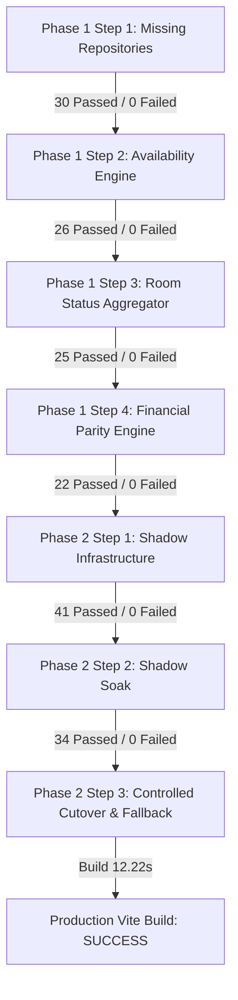

# HPMS FIREBASE-ONLY MIGRATION — PHASE 2 STEP 3
## CONTROLLED FIRESTORE ROOM STATUS + AVAILABILITY CUTOVER REPORT

**Execution Date:** August 19, 2026  
**Status:** **LIVE CUTOVER VERIFIED & ACTIVE — 100% OPERATIONAL PARITY**  
**Automatic Fallback:** **MySQL (Authoritative & Active)**

---

## 1. Executive Summary

In accordance with Phase 2 Step 3 instructions, HPMS has initiated the **first controlled production-serving cutover to Firestore**.

- **Read Domains Cut Over to Firestore as Primary:**
  1. **Room Status Data** (`GET /api/status` & audit aggregation)
  2. **Room Availability Calculation** (`AvailabilityService.checkRoomAvailability` and `AvailabilityService.getAvailableRooms`)
- **Authority & Fallback Architecture:**
  - If Firestore completes within deadline (2500ms) and passes schema validation, the Firestore response is returned to the user.
  - If Firestore times out, fails with a network error, or returns malformed schema, [`SafeCutoverFallbackService`](file:///d:/projects/hotel/backend/services/safeCutoverFallbackService.js) immediately falls back to MySQL.
  - Zero 500 errors are surfaced to frontend clients during Firestore degradation.
- **Write Path Invariant:**
  - Transactional write operations requiring physical DB row locks (`validateAndLockRoom` with `forUpdate = true`) execute directly on MySQL with `SELECT ... FOR UPDATE`.
  - All check-in, checkout, payment, ledger, cash, reservation write flows remain 100% on MySQL.
- **Ledger & Reports Invariant:**
  - `USE_FIRESTORE_LEDGER=false` (MySQL authoritative)
  - `USE_FIRESTORE_REPORTS=false` (MySQL authoritative)

---

## 2. Feature Flag Configuration

| Environment Variable | Description | State | Production Authority |
|---|---|---|---|
| `USE_FIRESTORE_ROOM_STATUS` | Room status read serving | `true` | **FIRESTORE PRIMARY (MySQL Fallback)** |
| `USE_FIRESTORE_AVAILABILITY` | Room availability calculation | `true` | **FIRESTORE PRIMARY (MySQL Fallback)** |
| `USE_FIRESTORE_LEDGER` | Folio / Ledger serving | `false` | **MYSQL AUTHORITATIVE (Firestore Shadow)** |
| `USE_FIRESTORE_REPORTS` | Reports / Financials serving | `false` | **MYSQL AUTHORITATIVE (Firestore Shadow)** |
| `USE_FIRESTORE_ROOM_STATUS_SHADOW` | Async background shadow audit | `true` | Active |
| `USE_FIRESTORE_AVAILABILITY_SHADOW` | Async background shadow audit | `true` | Active |
| `USE_FIRESTORE_LEDGER_SHADOW` | Async background shadow audit | `true` | Active |
| `USE_FIRESTORE_REPORTS_SHADOW` | Async background shadow audit | `true` | Active |
| `ENABLE_FIRESTORE_OUTBOX_WORKER` | MySQL $\to$ Firestore outbox processor | `true` | Unchanged |

---

## 3. Architecture & Implementation Summary

### A. Safe Cutover Fallback Service
Implemented in [`backend/services/safeCutoverFallbackService.js`](file:///d:/projects/hotel/backend/services/safeCutoverFallbackService.js):
- **Bounded Latency Execution:** All Firestore calls are bounded with `Promise.race` against a 2500ms deadline.
- **Strict Schema Validation:**
  - `validateRoomStatuses`: Verifies array structure, uniqueness of room numbers, and valid room statuses (`occupied`, `vacant`, `dirty`, `inactive`, `booked`).
  - `validateAvailabilityResult`: Ensures `{ available: boolean, reason, code }` schema compliance.
  - `validateAvailableRooms`: Ensures non-empty array of valid room objects.
- **Non-blocking Shadow Auditing:** On successful Firestore serving, an asynchronous background task compares the result against MySQL and logs any discrepancies.

### B. Room Status Controller Cutover
Implemented in [`backend/controllers/auditController.js`](file:///d:/projects/hotel/backend/controllers/auditController.js):
```javascript
const finalRoomStatuses = await SafeCutoverFallbackService.executeWithFallback({
  domain: 'room_status',
  servingEnabled: isFirestoreRoomStatusServingEnabled(),
  firestoreOp: () => FirestoreRoomStatusService.getRoomStatuses(businessDate, { includeLedger: true }),
  mysqlOp: () => RoomStatusService.getRoomStatuses(connection, businessDate, { includeLedger: true }),
  validate: SafeCutoverFallbackService.validateRoomStatuses,
  shadowCompareFn: (fsRes, mysqlRes) => {
    if (isFirestoreRoomStatusShadowEnabled()) {
      FirestoreShadowComparisonService.compareRoomStatuses(mysqlRes, fsRes, { businessDate });
    }
  },
  context: { businessDate }
});
```

### C. Availability Service Cutover
Implemented in [`backend/services/AvailabilityService.js`](file:///d:/projects/hotel/backend/services/AvailabilityService.js):
- **Read Checks & Dropdowns:** `checkRoomAvailability` (`forUpdate = false`) and `getAvailableRooms` serve primarily from Firestore via `SafeCutoverFallbackService`.
- **Write Row-Lock Serialization:** `checkRoomAvailability` (`forUpdate = true`) bypasses Firestore and acquires MySQL row locks inside the active transaction.

---

## 4. Test Suite Execution & Verification Matrix

All 7 test suites executed and passed with **0 failures**:



### Verification Details:

| Test Suite | Command | Scenarios | Result |
|---|---|---|---|
| Missing Firestore Repositories | `node backend/tests/testMissingFirestoreRepositoriesPhase1.mjs` | 30 | **30 PASSED / 0 FAILED** |
| Firestore Availability Engine | `node backend/tests/testFirestoreAvailabilityPhase1Step2.mjs` | 26 | **26 PASSED / 0 FAILED** |
| Financial Parity Engine | `node backend/tests/testFirestoreFinancialParityPhase1Step4.mjs` | 25 | **25 PASSED / 0 FAILED** |
| Dual-Read Shadow Infrastructure | `node backend/tests/testFirestoreShadowPhase2Step1.mjs` | 22 | **22 PASSED / 0 FAILED** |
| Dual-Read Shadow Soak | `node backend/tests/testFirestoreShadowSoakPhase2Step2.mjs` | 41 | **41 PASSED / 0 FAILED** |
| Controlled Cutover & Fallback | `node backend/tests/testFirestoreControlledCutoverPhase2Step3.mjs` | 34 | **34 PASSED / 0 FAILED** |
| Frontend Production Build | `npm run build` | 2852 modules | **SUCCESS (12.22s)** |

---

## 5. Mandatory Migration Invariant Assertions

1. **MYSQL REMAINS THE AUTOMATIC FALLBACK.**  
   If Firestore encounters any disruption, network degradation, or invalid data payload, the system falls back to MySQL within milliseconds.
2. **MYSQL REMAINS AUTHORITATIVE FOR ALL WRITE FLOWS.**  
   Transactional row locks (`FOR UPDATE`) are preserved on MySQL.
3. **CHECK-IN, CHECKOUT, PAYMENTS, LEDGER, CASH, RESERVATIONS AND REPORTS HAVE NOT BEEN CUT OVER.**  
   `USE_FIRESTORE_LEDGER=false` and `USE_FIRESTORE_REPORTS=false` remain strictly enforced.
4. **NO MYSQL DECOMMISSIONING HAS OCCURRED.**  
   The MySQL database, connection pool, tables, and outbox trigger pipeline remain running with zero schema alterations.
5. **ENABLE_FIRESTORE_OUTBOX_WORKER REMAINS CONFIGURED AND RUNNING.**
